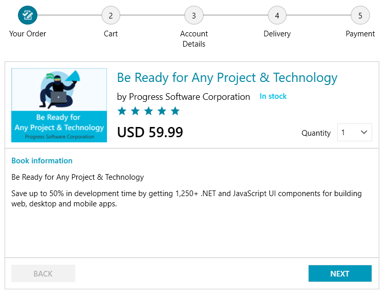

# Overview

__RadStepProgressBar__ enables you to setup a visual element that displays a multi-step process via number of different steps and a progress track bar between each step. Selecting a step will animate a progress movement from the previously selected step to the new one.





## Key Features

* __Easily customizable visuals__: The track bar and each step of the control can be customized by changing their default properties (like color and size) or by replacing the default visualization with a custom one. Read more it the [Appearance]() section of the documentation.

* __Data binding support__: RadStepProgressBar comes with built-in data binding support which allows you to provide a collection of any objects that can store information for each step. Read more in the [Data Binding]() article.

* __Horizontal and vertical orientations__: The control is arranged horizontally by default (left to right). Additionally, the control can be arranged vertically (top to bottom or bottom to top). Read more in the [Layout]() article.

* __Selection__: The steps in the progress bar can be selected in code or via click in the UI. Read more about the available API in the [Selection]() article.

* __Additional content__: Each step can display content on top and bottom of its visual element. The contents are optional and fully customizable. Read more in the [Step Item Contents]() article.

>tip Get started with the control with its [Getting Started]() help article that shows how to use it in a basic scenario.

> Check out the online demo at [demos.telerik.com](https://demos.telerik.com/wpf/).

## See Also
* [Layout]()
* [Visual Structure]()
* [Events]()
