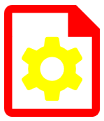

# Custom Brushes

The `RadSvgImage` component allows you to specify paint servers that will be applied to the displayed SVG image. This is done by setting the `CustomBrushes` property. This property is of the type of `Dictionary<string, Brush>`.

The following example shows how to utilize the CustomBrushes property:

#### __[XML] Defining a sample SVG file__
{{region radsvgimage-paint-servers-0}}
    <?xml version="1.0" encoding="utf-8"?>
    <svg xmlns="http://www.w3.org/2000/svg" xmlns:xlink="http://www.w3.org/1999/xlink" x="0px" y="0px"
    	 viewBox="0 0 512 512" enable-background="new 0 0 512 512" xml:space="preserve">
    	<defs>
    		<solidColor id="sheet-part"/>
    		<solidColor id="gear-part"/>
    	</defs>
    	<path id="sheet" fill="url(#sheet-part)" stroke="black" stroke-width="0" d="M352,32H96c-17.7,0-32,14.3-32,32v384c0,17.7,14.3,32,32,32h320c17.7,0,32-14.3,32-32V128L352,32z M416,448H96V64h224v96h96 V448z"/>
    	<path id="gear" fill="url(#gear-part)" stroke="black" stroke-width="0" d="M374.1,323.4l-23.7-17.9c1-5.7,1.6-11.5,1.6-17.4c0-6-0.5-11.8-1.6-17.4l23.7-17.9c3.7-2.8,4.7-7.9,2.4-11.9l-19.4-33.5
    		c-2.3-4-7.2-5.6-11.5-3.9L318.3,215c-8.8-7.5-19-13.5-30.2-17.4l-3.7-29.5c-0.6-4.6-4.5-8-9.1-8h-38.7c-4.6,0-8.5,3.4-9.1,8
    		l-3.7,29.5c-11.1,4-21.3,9.9-30.2,17.4l-27.4-11.6c-4.2-1.8-9.2-0.1-11.5,3.9l-19.4,33.5c-2.3,4-1.3,9.1,2.4,11.9l23.7,17.9
    		c-1,5.7-1.6,11.5-1.6,17.4c0,6,0.5,11.8,1.6,17.4l-23.7,17.9c-3.7,2.8-4.7,7.9-2.4,11.9l19.4,33.5c2.3,4,7.2,5.6,11.5,3.9l27.4-11.6
    		c8.8,7.5,19,13.5,30.2,17.4l3.7,29.5c0.6,4.6,4.5,8,9.1,8h38.7c4.6,0,8.5-3.4,9.1-8l3.7-29.5c11.1-4,21.3-9.9,30.2-17.4l27.4,11.6
    		c4.2,1.8,9.2,0.1,11.5-3.9l19.4-33.5C378.8,331.2,377.8,326.2,374.1,323.4z M256,336c-26.5,0-48-21.5-48-48c0-26.5,21.5-48,48-48
    		s48,21.5,48,48C304,314.5,282.5,336,256,336z"/>
    </svg>
{{endregion}}

Create a custom Dictionary<string, Brush> collection to define it in XAML:

#### __[C#] Defining a custom Dictionary collection__
{{region radsvgimage-paint-servers-1}}
    public class CustomDictionary : Dictionary<string, Brush> { }
{{endregion}}

#### __[VB.NET] Defining a custom Dictionary collection__
{{region radsvgimage-paint-servers-2}}
    Public Class CustomDictionary
        Inherits Dictionary(Of String, Brush)
    End Class
{{endregion}}

#### __[XAML] Creating a new instance of the custom Dictionary and add entries__
{{region radsvgimage-paint-servers-3}}
    <Grid>
        <Grid.Resources>
            <local:CustomDictionary x:Key="CustomBrushesDictionary">
                <SolidColorBrush x:Key="sheet-part" Color="Red"/>
                <SolidColorBrush x:Key="gear-part" Color="Yellow"/>
            </local:CustomDictionary>
        </Grid.Resources>
    </Grid>
{{endregion}}

#### __[XAML] Setting the new custom Dictionary instance to the CustomBrushes property__
{{region radsvgimage-paint-servers-4}}
    <Grid>
        <Grid.Resources>
            <local:CustomDictionary x:Key="CustomBrushesDictionary">
                <SolidColorBrush x:Key="sheet-part" Color="Red"/>
                <SolidColorBrush x:Key="gear-part" Color="Yellow"/>
            </local:CustomDictionary>
        </Grid.Resources>
        <telerik:RadSvgImage x:Name="svgImage"
                             UriSource="MySVGImage.svg" 
                             CustomBrushes="{StaticResource CustomBrushesDictionary}"
                             Width="128"
                             Height="128">
        </telerik:RadSvgImage>
    </Grid>
{{endregion}}

__RadSvgImage with custom Dictionary set to the CustomBrushes property__

## See Also
* [Animations]()
* [Clipping]()