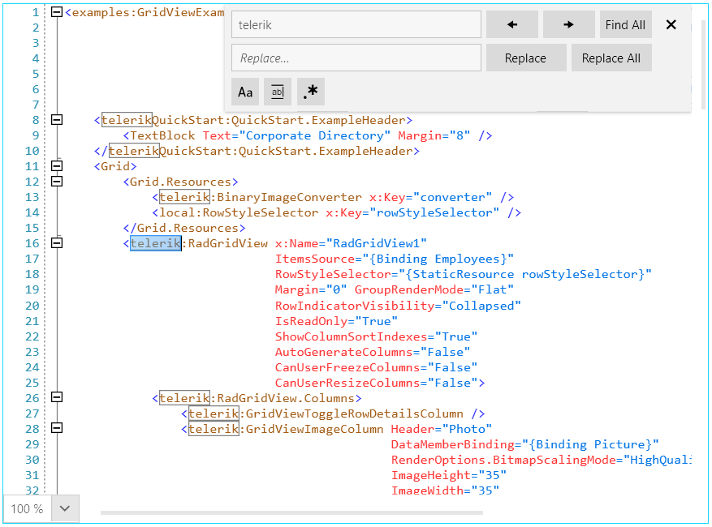

# Find and Replace

The RadSyntax editor provides an easy and intuitive way to search for a given text in the document as well as replace occurrences of this text.

## Find and Replace Dialog

By pressing the __Ctrl + F__ key combination you can open the find dialog which consist of UI to find a particular string and replace it with another. By using the arrow buttons, you can navigate to the previous or next occurrence of the search text. You can also highlight all occurrences of the text by clicking the `Find All` button. You can also replace the next occurrence of the string or all occurrences via the `Replace` and `Replace All` buttons respectively. To further customize the find and replace logic, you can use the buttons to apply case sensitivity, enable or disable matching of whole words, and use regex expressions.

__The Find Dialog__

## Programmatic Search

You can also search in the document programmatically by using the following methods exposed by the RadSyntaxEditor control.

### Find

The `Find` method takes as arguments the search string and the index from which to start the search. Optionally, you can also pass a parameter to control whether the casing of the letters should be matched and to specify whether the search string is a regular expression. The different overloads of the method are listed below.

* __Span? Find(string searchText, int startIndex)__
* __Span? Find(string searchText, int startIndex, bool useRegularExpression)__
* __Span? Find(string searchText, int startIndex, bool matchCase, bool useRegularExpression)__
* __Span? Find(string searchText, int startIndex, bool matchCase, bool useRegularExpression, bool matchWord)__

### FindAll

The `FindAll` method is identical to the Find method, with the difference being that it does not take a starting index as an argument and returns __all occurrences__ of the searched string in the document.

* __IEnumerable FindAll(string searchText)__
* __IEnumerable FindAll(string searchText, bool useRegularExpression)__
* __IEnumerable FindAll(string searchText, bool matchCase, bool useRegularExpression)__
* __IEnumerable FindAll(string searchText, bool matchCase, bool useRegularExpression, bool matchWord)__

### FindPrevious

The `FindPrevious` method works similarly to the Find method, with the difference that the search is performed from the starting index towards the beginning of the document. It has a single overload with the following definition:

* __Span? FindPrevious(string searchText, int startIndex, bool matchCase)__
* __Span? FindPrevious(string searchText, int startIndex, bool matchCase, bool useRegularExpression, bool matchWord)__

### NavigateNextMatch and NavigatePreviousMatch

The `NavigateNextMatch` and `NavigatePreviousMatch` methods can be used to find the next and previous occurrence of the searched text with regards to the current position of the control's **caret**. The search performed by these methods is case-insensitive. All folded regions which contain the matched span are unfolded when this method is invoked.

* __void NavigateNextMatch(string searchText)__
* __void NavigatePreviousMatch(string searchText)__

### HighlightAllMatches

The `HighlightAllMatches` method finds all occurrences of the searched text in the document and, if there is a registered `TextSearchHighlightTagger`, highlights them by using the specified `TextFormatDefinitions`. The performed search is case-insensitive.

* __void HighlightAllMatches(string searchText)__

## ReplaceAllMatches

The `RemplaceAllMatches` method finds all occurrences of the searched text and replaces them with the new input.

* __int ReplaceAllMatches(string searchText, string replaceText, bool matchCase, bool useRegularExpression)__
* __int ReplaceAllMatches(string searchText, string replaceText, bool matchCase, bool useRegularExpression, bool matchWord)__

### OpenFindDialog and CloseFindDialog

Invoking the `OpenFileDialog` method opens the find and replace dialog with the specified search text in the search textbox. The `CloseFindDialog` in turn sets the dialog's `Visibility` to `Collapsed`.

* __void OpenFindDialog(string searchText)__
* __void CloseFindDialog()__

## SearchPanelWidth

The RadSyntaxEditor control exposes a `SearchPanelWidth` property which you can use to control the width of the find and replace dialog.

>Setting this property may be necessary if you've localized the control in a language other than English or have defined custom strings for the buttons of the dialog, which, in turn, clips their content.

#### __[XAML] Setting SearchPanelWidth__
{{region xaml-radsyntaxeditor-features-find-replace-0}}

    <telerik:RadSyntaxEditor x:Name="SyntaxEditor" SearchPanelWidth="600" />
{{endregion}}

#### __[C#] Setting SearchPanelWidth__
{{region cs-radsyntaxeditor-features-find-replace-0}}

    this.SyntaxEditor.SearchPanelWidth = 600;
{{endregion}}

#### __[VB.NET] Setting SearchPanelWidth__
{{region vb-radsyntaxeditor-features-find-replace-0}}

    Me.SyntaxEditor.SearchPanelWidth = 600
{{endregion}}

## See Also

* [Selection]()
* [IntelliPrompts]()