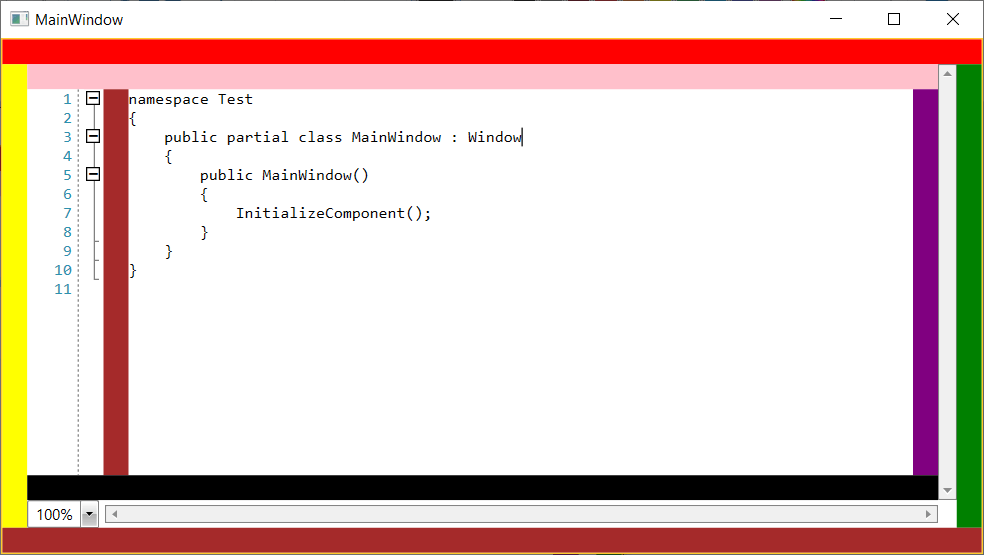

# Margins

The RadSyntaxEditor control contains several panels inside its ControlTemplate, which allow for customizing its look and/or extending its functionality. In order to customize them you can use the Margins property, which is of type [SyntaxEditorMargins](https://docs.telerik.com/devtools/wpf/api/telerik.windows.controls.syntaxeditor.ui.margins.syntaxeditormargins).

## Margin Panels

__Example 1__ demonstrates how you can add some custom elements around the RadSyntaxEditor and provides a visualization of the default locations for all panels. It also demonstrates the line numbers and [folding taggger]() features, which are implemented with the help of the left scrollable margin.

#### __[XAML] Example 1: Defining the RadSyntaxEditor__
{{region xaml-radsyntaxeditor-features-margins-0}}

	<Grid xmlns:telerik="http://schemas.telerik.com/2008/xaml/presentation">
        <telerik:RadSyntaxEditor x:Name="syntaxEditor" />
    </Grid>
{{endregion}}

#### __[C#] Example 1: Defining the RadSyntaxEditor__
{{region cs-radsyntaxeditor-features-margins-1}}

	public partial class MainWindow : Window
    {
        public MainWindow()
        {
            InitializeComponent();

            using (StreamReader reader = new StreamReader("../../Files/MainWindow.xaml.cs"))
            {
                this.syntaxEditor.Document = new TextDocument(reader);
            }

            var foldingTagger = new CSharpFoldingTagger(this.syntaxEditor);
            this.syntaxEditor.TaggersRegistry.RegisterTagger(foldingTagger);

            this.syntaxEditor.Margins.Left.Add(new Rectangle() { Fill = Brushes.Yellow, Width = 20 });
            this.syntaxEditor.Margins.Right.Add(new Rectangle() { Fill = Brushes.Green, Width = 20 });
            this.syntaxEditor.Margins.Top.Add(new Rectangle() { Fill = Brushes.Red, Height = 20 });
            this.syntaxEditor.Margins.Bottom.Add(new Rectangle() { Fill = Brushes.Brown, Height = 20 });
            this.syntaxEditor.Margins.ScrollableLeft.Add(new Rectangle() { Fill = Brushes.Brown, Width = 20 });
            this.syntaxEditor.Margins.ScrollableRight.Add(new Rectangle() { Fill = Brushes.Purple, Width = 20 });
            this.syntaxEditor.Margins.ScrollableTop.Add(new Rectangle() { Fill = Brushes.Pink, Height = 20 });
            this.syntaxEditor.Margins.ScrollableBottom.Add(new Rectangle() { Fill = Brushes.Black, Height = 20 });
        }
    }
{{endregion}}

#### __Figure 1: RadSyntaxEditor Margins__

## See Also

* [Taggers]()
* [Selection]()
