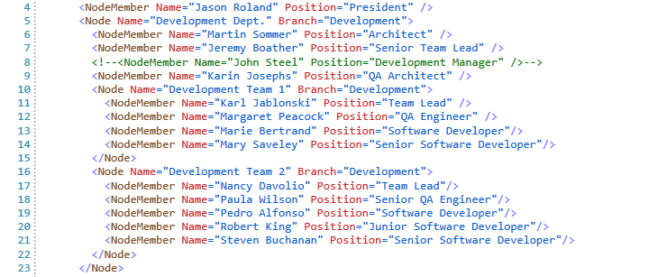

# Palettes

The RadSyntaxEditor comes with 4 different **palettes** which you can choose from - **Light**, **Dark**, **Neutral** and **Neutral Dark**. They are responsible for applying different colors to the syntax-related words of the control.

## Palette List

Here is a list of all the colors in the palettes and their default values for each palette.

|Property|Light|Dark|Neutral|Neutral Dark|
|---|:---:|:---:|:---:|:---:|
|**KeywordColor**|

|

|

|

|
|**PreprocessorKeywordColor**|

|

|

|

|
|**CommentColor**|

|

|

|

|
|**IdentifierColor**|

|

|

|

|
|**OperatorColor**|

|

|

|

|
|**StringColor**|

|

|

|

|
|**XmlAttributeColor**|

|

|

|

|
|**XmlElementColor**|

|

|

|

|
|**XmlCommentColor**|

|

|

|

|
|**XmlContentColor**|

|

|

|

|
|**XmlStringColor**|

|

|

|

|
|**XmlTagColor**|

|

|

|

|

## Palette Recommendations

The table below lists the recommended palettes for each of the [available themes]() in the UI for WPF suite. If you're using any of the theme-variation combinations marked with an asterisk (__*__), you need to explicitly set the RadSyntaxEditor's Palette as they will not be updated when the theme variation is changed.

|Theme|Palette|
|---|---|
|VisualStudio2019|Light|
|Crystal Light|Light|
|Crystal Dark __*__|Dark|
|Fluent Light|Light|
|Fluent Dark __*__|Dark|
|Material|Light|
|Office2016(Touch)|Light|
|Green Dark|Neutral Dark|
|Green Light __*__|Neutral|
|VisualStidio2013|Light|
|VisualStidio2013 Blue|Light|
|VisualStidio2013 Dark __*__|Dark|
|Office2013|Light|
|Office2013 LightGray|Light|
|Office2013 DarkGray|Light|
|Windows8(Touch)|Light|
|Expression_Dark|Neutral Dark|
|Windows7|Light|
|Transparent|Neutral|
|Vista|Light|
|Summer|Light|
|Office_Black|Light|
|Office_Silver|Light|
|Office_Blue|Light|

#### __[C#] Example 1: Change the palette when using a specific theme__
{{region cs-radsyntaxeditor-features-palettes-1}}
    
    switch (theme)
    {
       case "Crystal_Dark":
			this.syntaxEditor.Palette = SyntaxPalettes.Dark;
			break;
		case "Fluent_Dark":
			this.syntaxEditor.Palette = SyntaxPalettes.Dark;
			break;
		case "Green_Light":
			this.syntaxEditor.Palette = SyntaxPalettes.Neutral;
			break;
		case "Green_Dark":
			this.syntaxEditor.Palette = SyntaxPalettes.NeutralDark;
			break;
		case "VisualStudio2013_Dark":
			this.syntaxEditor.Palette = SyntaxPalettes.Dark;
			break;
		case "Expression_Dark":
			this.syntaxEditor.Palette = SyntaxPalettes.NeutralDark;
			break;
		case "Transparent":
			this.syntaxEditor.Palette = SyntaxPalettes.Neutral;
			break;
		default:
			this.syntaxEditor.Palette = SyntaxPalettes.Light;
			break;
    }
{{endregion}}

## Custom Palettes

If you want to customize the colors shown in your RadSyntaxEditor control, you can do so by either modifying one of the default palettes or by creating a new instance of the **SyntaxEditorPalette** class and setting all of its colors.

>important It is not possible to edit the colors of the default palettes during runtime.

### Modify a Default Palette

#### __[XAML] Example 2: Modifying a default palette in XAML__
{{region xaml-radsyntaxeditor-features-palettes-2}}
    
    <Grid xmlns:palettes="clr-namespace:Telerik.Windows.Controls.SyntaxEditor.Palettes;assembly=Telerik.Windows.Controls.SyntaxEditor">
        <Grid.Resources>
            <palettes:LightPalette x:Key="ModifiedLightPalette" KeywordColor="Green" CommentColor="Red" />
        </Grid.Resources>
        <telerik:RadSyntaxEditor x:Name="syntaxEditor" Palette="{StaticResource ModifiedLightPalette}"/>
    </Grid>
{{endregion}}

#### Figure 2: RadSyntaxEditor with a modified Light palette

### Create a Custom Palette

#### __[C#] Example 3: Creating a custom SyntaxEditorPalette in code-behind__
{{region cs-radsyntaxeditor-features-palettes-3}}
    
    var customPalette = new SyntaxEditorPalette();
    customPalette.KeywordColor = (Color)ColorConverter.ConvertFromString("#3232eb");
    customPalette.PreprocessorKeywordColor = (Color)ColorConverter.ConvertFromString("#848484");
    customPalette.CommentColor = (Color)ColorConverter.ConvertFromString("#006633");
    customPalette.IdentifierColor = (Color)ColorConverter.ConvertFromString("#000000");
    customPalette.OperatorColor = (Color)ColorConverter.ConvertFromString("#323232");
    customPalette.XmlAttributeColor = (Color)ColorConverter.ConvertFromString("#cc2828");
    customPalette.XmlElementColor = (Color)ColorConverter.ConvertFromString("#824910");
    customPalette.XmlCommentColor = (Color)ColorConverter.ConvertFromString("#007b00");
    customPalette.XmlContentColor = (Color)ColorConverter.ConvertFromString("#474747");
    customPalette.XmlStringColor = (Color)ColorConverter.ConvertFromString("#0066cc");
    customPalette.XmlTagColor = (Color)ColorConverter.ConvertFromString("#7070ff");
    this.syntaxEditor.Palette = customPalette;
{{endregion}}

#### Figure 2: RadSyntaxEditor with a custom palette

## See Also

* [Visual Structure]()
* [Available Themes]()
