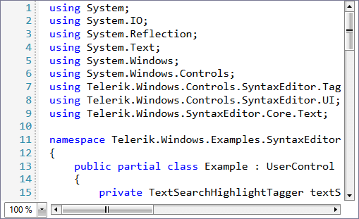

# Taggers

The RadSyntaxEditor control works with the underlying document with the help of **taggers**. Taggers are used to identify spans of text and assign them a specific tag if they match a specific condition. The identification process occurs in the **GetTags** method which can be overridden in a [custom tagger]().

The matched tags are then processed by the [UI layers]() which color the text or draw additional elements on screen.

#### Figure 1: RadSyntaxEditor with a registered CSharpTagger

## Predefined Taggers

The RadSyntaxEditor comes with a number of predefined taggers:

* **CSharpTagger**: A tagger responsible for the syntax-highlighting in the **C#** programming language.
* **VisualBasicTagger**: A tagger responsible for the syntax-highlighting in the **Visual Basic** programming language.
* **JavaScriptTagger**: A tagger responsible for the syntax-highlighting in the **JavaScript** programming language.
* **XmlTagger**: A tagger responsible for the syntax-highlighting in the **XML** programming language.
* **SqlTagger**: A tagger responsible for the syntax-highlighting in the **T-SQL (Transact-SQL)** programming language.
* **BracketFoldingTagger**: A tagger responsible for creating collapsible (folding) regions in the code. Can be used for the **JavaScript** language.
* **CSharpFoldingTagger**: A tagger responsible for creating **folding regions** in **C#** code.
* **VisualBasicFoldingTagger**: A tagger responsible for creating **folding regions** in **Visual Basic** code.
* **TextSearchHighlightTagger**: A tagger which prepares collection of **TextHighlightTag** for all occurrences of a given search word.
* **TextSearchUnderlineTagger**: A tagger which prepares collection of **UnderlineTag** for all occurrences of a given search word.

## Register a Tagger

To be able to use these taggers in the RadSyntaxEditor control, you first need to register them in its **TaggersRegistry**. This registry keeps track of all the registered taggers. Through the **IsTaggerRegistered** method you can check whether a specific tagger is already registered.

#### __[C#] Example 1: Registering taggers__
{{region cs-radsyntaxeditor-features-taggers-1}}
    
    var cSharpTagger = new CSharpTagger(this.syntaxEditor);            
    if (!this.syntaxEditor.TaggersRegistry.IsTaggerRegistered(cSharpTagger))
    {
        this.syntaxEditor.TaggersRegistry.RegisterTagger(this.cSharpTagger);
    }

    var textSearchTagger = new TextSearchHighlightTagger(this.syntaxEditor, TextSearchHighlightTagger.SearchFormatDefinition);
    if (!this.syntaxEditor.TaggersRegistry.IsTaggerRegistered(textSearchTagger))
    {
        this.syntaxEditor.TaggersRegistry.RegisterTagger(this.textSearchTagger);
    }
{{endregion}}

## See Also

* [UI Layers]()
* [Word Taggers]()
* [Folding Taggers]()