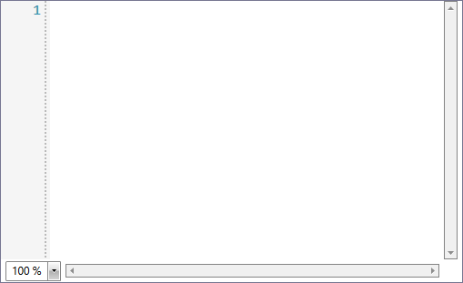

# Getting Started

This tutorial will walk you through the creation of a sample application that contains a __RadSyntaxEditor__ control.
			
## Assembly References

In order to use __RadSyntaxEditor__, you will need to add references to the following assemblies:
* __Telerik.Windows.Controls__
* __Telerik.Windows.Controls.Input__
* __Telerik.Windows.Controls.SyntaxEditor__
* __Telerik.Windows.SyntaxEditor.Core__

You can find the required assemblies for each control from the suite in the [Controls Dependencies]() help article.

## Defining RadSyntaxEditor

__Example 1__ demonstrates how you can define a RadSyntaxEditor in XAML.

#### __[XAML] Example 1: Defining RadSyntaxEditor__
{{region xaml-radsyntaxeditor-getting-started-0}}
    <telerik:RadSyntaxEditor x:Name="syntaxEditor" />
{{endregion}}

#### __Figure 1: Empty RadSyntaxEditor__

## Opening a File

To load a file in the RadSyntaxEditor you need to use its **Document** property.

#### __[C#] Example 2: Opening a File__
{{region cs-RadSyntaxEditor-getting-started-1}}
    public MainWindow()
    {
        InitializeComponent();

        using (StreamReader reader = new StreamReader("../../CS_File.txt"))
        {
            this.syntaxEditor.Document = new TextDocument(reader);
        }
    }
{{endregion}}

#### __Figure 2: RadSyntaxEditor with a loaded CS file__

## See Also 

* [Visual Structure]()