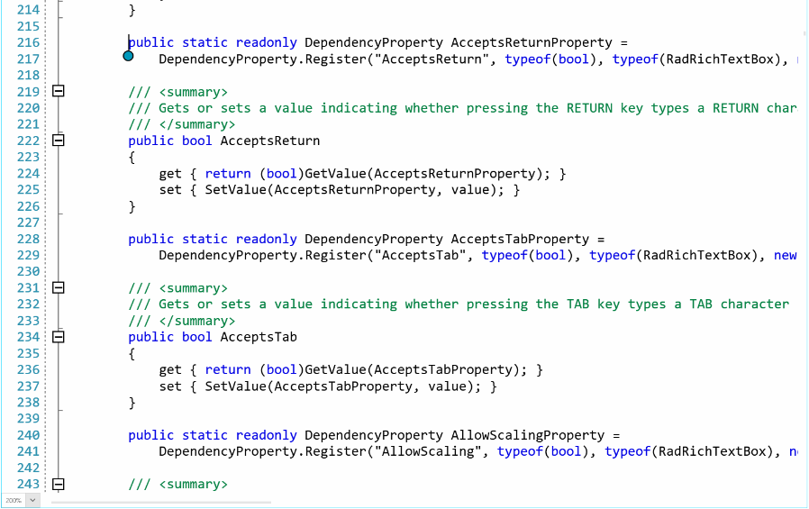

# Touch

The RadSyntaxEditor comes with out-of-the-box support for touch gestures.

When using touch, touch selector markers appear when the user taps on the editor. Swiping **30 pixels** around them moves the selection's start/end. Switching to a mouse device hides the markers. The markers are also hidden during a swipe or pinch. Swiping over the line numbers selects each of the lines the swipe passes over.

## Supported Touch Gestures

|Gesture|RadSyntaxEditor Action|
|-------|-----------------|
|Tap|Moves the caret under the finger|
|Double Tap|Selects the word under the finger|
|Pinch|Scales the document (the ScaleFactor changes)|
|Swipe|Scrolls the document|
|Swipe inertia|Scrolls the document continuously with increased speed|

## Override Default Touch Logic

If you wish to implement your own touch logic, you can override the **InitializeTouch** method of the **RadSyntaxEditor**.

#### __[C#] Example 1: Default InitializeTouch method__
{{region cs-radsyntaxeditor-touch-0}}

        protected override void InitializeTouch(SyntaxEditorPresenter presenter)
        {
            TouchManager.AddSwipeEventHandler(presenter, new SwipeEventHandler(OnSwipe));
            base.InitializeTouch(presenter);
        }

        private void OnSwipe(object sender, SwipeEventArgs args)
        {
            // your custom logic for swiping
            args.Handled = true; // you can omit this if your custom logic does not contradict with the default logic
        }
{{endregion}}

## Increase Markers Drag Area

By default, dragging the markers is possible if the swipe occurs up to **30 pixels** from their center. This area can be controlled via the **TouchMarkerDragDistance** property of the **SyntaxEditorPresenter**.

#### __[C#] Example 2: Increase markers drag area__
{{region cs-radsyntaxeditor-touch-1}}

    this.syntaxEditor.EditorPresenter.TouchMarkerDragDistance = 40;
{{endregion}}

## See Also

* [Events]()
* [Commands]()