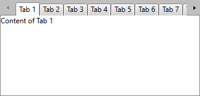
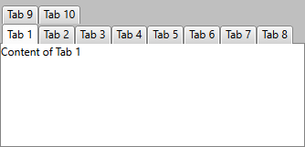

# Create Multi-Line Tabs

Multi-line tabs can be created using the __IsBreak__ property of the __RadTabItem__. The property is of __Boolean__ type and the possible values are __True__ or __False__. If it’s __True__, then the next tab items you add will be placed on a new line inserted right above the item which property __IsBreak__ is set to __True__; if it’s __False__, no break is inserted.

#### __[XAML] Example 1: Set an item's IsBreak property__

{{region radtabcontrol-features-multiline-tabs_0}}
	<telerik:RadTabControl x:Name="radTabControl" SelectedIndex="0">
	    <telerik:RadTabItem Header="Calendar"/>
	    <telerik:RadTabItem Header="Colors" IsBreak="True"/>
	    <telerik:RadTabItem Header="Quote"/>
	</telerik:RadTabControl>
{{endregion}}

In the above example the property __IsBreak__ of the tab item "Colors" is set to __True__ and the next tab item "Quote" is placed on a new line above all other tab items.

## OverflowMode

By default, the RadTabControl will display two arrows when the width of the tab items exceeds the available width with which you can bring the rest of the items into view. This is illustrated in **Figure 1**.

#### Figure 1: RadTabControl with default overflow mode

If you would, however, like all items to be in the viewport and appear one above the other in separate rows, you can set the control's **OverflowMode** property to **Wrap**. The result from setting this property can be seen in **Figure 2**.

#### __[XAML] Example 2: Set the control's OverflowMode__

{{region radtabcontrol-features-multiline-tabs_0}}
	<telerik:RadTabControl x:Name="radTabControl" SelectedIndex="0" OverflowMode="Wrap">
		<!-- ... -->
	</telerik:RadTabControl>
{{endregion}}

#### Figure 2: RadTabControl with Wrap OverflowMode

## See Also

* [Controlling Behavior]()
* [How to Change the Position of the Tab Strip of RadTabControl]()