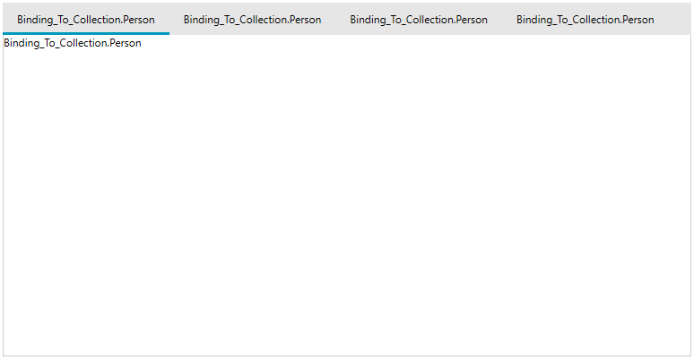

# Binding To Collection

The purpose of this tutorial is to show you how to bind a __RadTabControl__ to a collection of business objects.				

When you want the tabs of the __RadTabControl__ to be automatically generated on the basis of a collection, use the __ItemsSource__ property.				

* Create a new class named __Person__. The class' structure is shown on the next code-snippet.		
				
	#### __[C#] Example 1: Creating Person class__	
	{{region radtabcontrol-populating-binding-to-collection_0}}
		public class Person
		{
			public Person( string name, int age )
			{
				this.Name = name;
				this.Age = age;
			}
			public string Name { get; set; }
			public int Age { get; set; }
		}
	{{endregion}}
	
	#### __[VB.NET] Example 1: Creating Person class__	
	{{region radtabcontrol-populating-binding-to-collection_1}}
		Public Class Person
			Public Sub New(ByVal name As String, ByVal age As Integer)
				Me.Name = name
				Me.Age = age
			End Sub
		
		Private _Name As String
			Public Property Name() As String
				Get
					Return _Name
				End Get
				Set(ByVal value As String)
					_Name = value
				End Set
			End Property
		
		Private _Age As Integer
			Public Property Age() As Integer
				Get
					Return _Age
				End Get
				Set(ByVal value As Integer)
					_Age = value
				End Set
			End Property
		End Class
	{{endregion}}

* Create a new class named __ViewModel__, like the example below:						

	#### __[C#] Example 2: Creating ViewModel class__
	{{region radtabcontrol-populating-binding-to-collection_2}}
		public class ViewModel
		{
			public ViewModel()
			{
				this.Persons = new ObservableCollection<Person>();
				this.Persons.Add( new Person( "Ivan", 23 ) );
				this.Persons.Add( new Person( "Stefan", 34 ) );
				this.Persons.Add( new Person( "Maria", 16 ) );
				this.Persons.Add( new Person( "Michael", 78 ) );
			}
			public ObservableCollection<Person> Persons { get; set; }
		}
	{{endregion}}

	#### __[VB.NET] Example 2: Creating ViewModel class__ 
	{{region radtabcontrol-populating-binding-to-collection_3}}
		Public Class ViewModel
			Public Sub New()
				Me.Persons = New ObservableCollection(Of Person)()
				Me.Persons.Add(New Person("Ivan", 23))
				Me.Persons.Add(New Person("Stefan", 34))
				Me.Persons.Add(New Person("Maria", 16))
				Me.Persons.Add(New Person("Michael", 78))
			End Sub
		
		Private _Persons As ObservableCollection(Of Person)
			Public Property Persons() As ObservableCollection(Of Person)
				Get
					Return _Persons
				End Get
				Set(ByVal value As ObservableCollection(Of Person))
					_Persons = value
				End Set
			End Property
		End Class
	{{endregion}}

	As you can see the __ViewModel__ class has a reference to an observable collection of __Person__ objects. In fact this will be set to the __ItemsSource__ property of the __RadTabControl__. Also that in the class' constructor the collection is initialized with some sample data.

* Set the DataContext of the MainWindow.						
  
	#### __[C#] Example 2: Setting DataContext__ 
	{{region radtabcontrol-populating-binding-to-collection_4}}
		public partial class MainWindow : Window
		{
			public MainWindow()
			{
				InitializeComponent();
				this.DataContext = new ViewModel();
			}
		}
	{{endregion}}

* Set the __ItemsSource__ property of the __RadTabControl__.						

	#### __[XAML] Example 3: Binding the ItemsSource Property__ 
	{{region radtabcontrol-populating-binding-to-collection_5}}
		<telerik:RadTabControl x:Name="tabControl"
			ItemsSource="{Binding Source={StaticResource DataSource}, Path=Persons}"/>
	{{endregion}}

	Now when you run the demo the result should be similar to the next image.
	
	
	The reason for this result is that the __RadTabControl__ "still doesn't know" how to display these business objects. You need to "say" explicitly what to be displayed as a __Header__ using either the __DisplayMemberPath__ property or setting the __HeaderTemplate__ property. Additionally you need to set a __ContentTemplate__.						

* Set the __DisplayMemberPath__ property of the __RadTabControl__ to "Name" and create custom __DataTemplate__ for the __ContentTemplate__ property.					

	#### __[XAML] Example 4: Binding the ItemsSource Property__   
	{{region radtabcontrol-populating-binding-to-collection_7}}
		<Window.Resources>
			<DataTemplate x:Key="ContentTemplate">
				<Grid>
					<TextBlock Text="{Binding Age}"/>
				</Grid>
			</DataTemplate>
		</Window.Resources>
		<Grid x:Name="LayoutRoot" Background="White">
			<telerik:RadTabControl x:Name="radTabControl" Margin="8" ItemsSource="{Binding Path=Persons}" 
				DisplayMemberPath="Name" 
				ContentTemplate="{StaticResource ContentTemplate}"/>
		</Grid>
	{{endregion}}

	The final result is shown on the next image:
	

	When the __ItemsSource__ is specified, __RadTabItem__ containers are generated for each item in the collection. By using the template properties of the __RadTabControl__ and the __RadTabItem__ you can [control the appearance and the visualization]() of the items in the collection. 

## Suppress Selected Content Template Reapplying

By default, the __RadTabControl__ keeps one __ContentPresenter__ for all its Items and reapplies its __ContentPresenter.ContentTemplate__ on each selection change. In scenarios where the ItemsSource has changed runtime, it could lead to a performance hit. RadTabControl expose a __SupressSelectedContentTemplateReapplying__ property which can be used to avoid this. By default this property is set to __False__ along with the __IsContentPreserved__ property. If you set it to __True__, then the __RadTabControl__ will still have one __ContentPresenter__, but it won't reset its __ContentTemplate__ whenever the selection is changed, and this will increase the performance when ItemsSource is changed runtime.

>Please keep in mind that if you set the SupressSelectedContentTemplateReapplying property to True the same RadTabControl.ContentTemplate is applied to all RadTabItems. And if the ControlTemplate elements aren't databound, the same values will be displayed in all RadTabItems.	

## See Also  
 * [Customizing Appearance]()
 * [Add and Remove Tabs]()
 * [Data Binding]()
