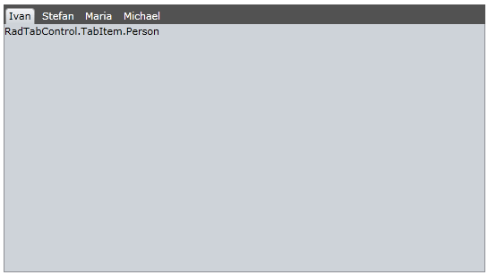
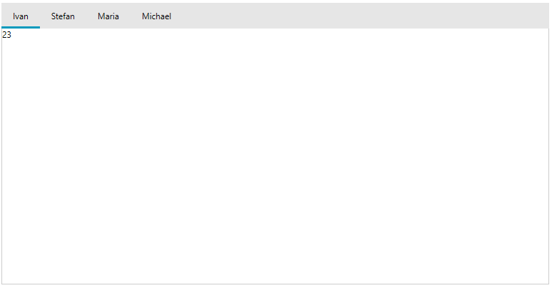

# Binding To Collection

The purpose of this tutorial is to show you how to bind a __RadTabControl__ to a collection of business objects.				

When you want the tabs of the __RadTabControl__ to be automatically generated on the basis of a collection, use the __ItemsSource__ property.				

* Create a new class named __Person__. The class' structure is shown on the next code-snippet.						

	#### __C#__  
	{{region radtabcontrol-populating-binding-to-collection_0}}
		public class Person
		{
			public Person( string name, int age )
			{
				this.Name = name;
				this.Age = age;
			}
			public string Name { get; set; }
			public int Age { get; set; }
		}
	{{endregion}}

	#### __VB.NET__  
	{{region radtabcontrol-populating-binding-to-collection_1}}
		Public Class Person
			Public Sub New(ByVal name As String, ByVal age As Integer)
				Me.Name = name
				Me.Age = age
			End Sub
		
		Private _Name As String
			Public Property Name() As String
				Get
					Return _Name
				End Get
				Set(ByVal value As String)
					_Name = value
				End Set
			End Property
		
		Private _Age As Integer
			Public Property Age() As Integer
				Get
					Return _Age
				End Get
				Set(ByVal value As Integer)
					_Age = value
				End Set
			End Property
		End Class
	{{endregion}}

* Create a new class named __ViewModel__, like the example below:						

	#### __C#__  
	{{region radtabcontrol-populating-binding-to-collection_2}}
		public class ViewModel
		{
			public ViewModel()
			{
				this.Persons = new ObservableCollection<Person>();
				this.Persons.Add( new Person( "Ivan", 23 ) );
				this.Persons.Add( new Person( "Stefan", 34 ) );
				this.Persons.Add( new Person( "Maria", 16 ) );
				this.Persons.Add( new Person( "Michael", 78 ) );
			}
			public ObservableCollection<Person> Persons { get; set; }
		}
	{{endregion}}

	#### __VB.NET__  
	{{region radtabcontrol-populating-binding-to-collection_3}}
		Public Class ViewModel
			Public Sub New()
				Me.Persons = New ObservableCollection(Of Person)()
				Me.Persons.Add(New Person("Ivan", 23))
				Me.Persons.Add(New Person("Stefan", 34))
				Me.Persons.Add(New Person("Maria", 16))
				Me.Persons.Add(New Person("Michael", 78))
			End Sub
		
		Private _Persons As ObservableCollection(Of Person)
			Public Property Persons() As ObservableCollection(Of Person)
				Get
					Return _Persons
				End Get
				Set(ByVal value As ObservableCollection(Of Person))
					_Persons = value
				End Set
			End Property
		End Class
	{{endregion}}

	As you can see the __ViewModel__ class has a reference to an observable collection of __Person__ objects. In fact this will be set to the __ItemsSource__ property of the __RadTabControl__. Also that in the class' constructor the collection is initialized with some sample data.

* Declare your __ViewModel__ as a resource.						

	#### __XAML__  
	{{region radtabcontrol-populating-binding-to-collection_4}}
		<UserControl.Resources>
			<example:ViewModel x:Key="DataSource"/>
		</UserControl.Resources>
	{{endregion}}

* Set the __ItemsSource__ property of the __RadTabControl__.						

	#### __XAML__  
	{{region radtabcontrol-populating-binding-to-collection_5}}
		<telerik:RadTabControl x:Name="tabControl"
			ItemsSource="{Binding Source={StaticResource DataSource}, Path=Persons}"/>
	{{endregion}}

	Run your demo. The result should be similar to the next image.
	
	
	The reason for this result is that the __RadTabControl__ "still doesn't know" how to display these business objects. You need to "say" explicitly what to be displayed as a __Header__ using either the __DisplayMemberPath__ property or setting the __HeaderTemplate__ property. Additionally you need to set a __ContentTemplate__.						

* Set the __DisplayMemberPath__ property of the __RadTabControl__ to "Name".						

	#### __XAML__  
	{{region radtabcontrol-populating-binding-to-collection_6}}
		<telerik:RadTabControl x:Name="radTabControl"
			ItemsSource="{Binding Source={StaticResource DataSource}, Path=Persons}"
			DisplayMemberPath="Name"/>
	{{endregion}}

	The result should look like the image below.
	

* The final step is to create a __DataTemplate__ and set it as a __ContentTemplate__.						

	#### __XAML__  
	{{region radtabcontrol-populating-binding-to-collection_7}}
		<UserControl.Resources>
			<example:ViewModel x:Key="DataSource"/>
		
			<DataTemplate x:Key="ContentTemplate">
				<Grid>
					<TextBlock Text="{Binding Age}"/>
				</Grid>
			</DataTemplate>
		
		</UserControl.Resources>
		<Grid x:Name="LayoutRoot" Background="White">
		
			<telerik:RadTabControl x:Name="radTabControl" Margin="8"
				ItemsSource="{Binding Source={StaticResource DataSource}, Path=Persons}"
				DisplayMemberPath="Name"
				ContentTemplate="{StaticResource ContentTemplate}"/>
		
		</Grid>
	{{endregion}}

	The final result is shown on the next image:
	

	When the __ItemsSource__ is specified, __RadTabItem__ containers are generated for each item in the collection. By using the template properties of the __RadTabControl__ and the __RadTabItem__ you can [control the appearance and the visualization]() of the items in the collection. 

## See Also  
 * [Customizing Appearance]()

 * [Add and Remove Tabs]()

 * [Data Binding]()
