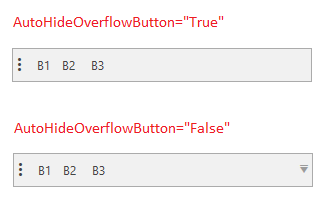

# Overflow Items

The RadToolBar control automatically hides part of its items in the overflow area when there is not enough space to display all.

#### __[XAML] Example 1: Overflow area example__
{{region radtoolbar-features-overflow-items-0}}
	<telerik:RadToolBar Width="80">
		<telerik:RadButton Content="B1" />
		<telerik:RadButton Content="B2 " />
		<telerik:RadButton Content="B3" />
	</telerik:RadToolBar>
{{endregion}}

## Overflow Button Visibility

By default the overflow button is always visible whether there are items in the overflow area or not. To change this, set the `AutoHideOverflowButton` property of `RadToolBar` to `True`.

#### __[XAML] Example 2: Setting AutoHideOverflowButton__
{{region radtoolbar-features-overflow-items-1}}
	<telerik:RadToolBar AutoHideOverflowButton="True">
		<telerik:RadButton Content="B1" />
		<telerik:RadButton Content="B2 " />
		<telerik:RadButton Content="B3" />
	</telerik:RadToolBar>
{{endregion}}

To manually control the overflow button visibility, set the `OverflowButtonVisibility` property.

#### __[XAML] Example 3: Setting OverflowButtonVisibility__
{{region radtoolbar-features-overflow-items-2}}
	<telerik:RadToolBar OverflowButtonVisibility="Collapsed">
		<telerik:RadButton Content="B1" />
		<telerik:RadButton Content="B2 " />
		<telerik:RadButton Content="B3" />
	</telerik:RadToolBar>
{{endregion}}

## Open Overflow Area Manually

To open or close the over flow area manually, set the `IsOverflowOpen` property of `RadToolBar`.

#### __[C#] Example 4: Open the overflow area manually__
{{region radtoolbar-features-overflow-items-3}}
	private void Button_Click(object sender, RoutedEventArgs e)
	{
		this.radToolbar.IsOverflowOpen = true;
	}
{{endregion}}

## Overflow Items

The items that are in the overflow area can be accessed through the `OverflowItems` property of `RadToolBar`.

#### __[C#] Example 5: Getting the first item from the overflow area__
{{region radtoolbar-features-overflow-items-4}}	
	object element = this.radToolbar.OverflowItems[0];
{{endregion}}

> Adding items in the `OverflowItems` collection manually is not supported.

To manually determine what controls from the toolbar should be added in the toolbar use the `RadToolBar.OverflowMode` attached property. The property allows setting the following modes:

* `AsNeeded`: The item can be shown in the overflow area if there is not enough space in the toolbar. This is the default mode of the items.
* `Always`: The item will always be shown in the overflow area.
* `Never`: The item will never be shown in the overflow area.

#### __[XAML] Example 6: Setting OverflowMode__
{{region radtoolbar-features-overflow-items-5}}
	<telerik:RadToolBar>
		<telerik:RadButton Content="B1" telerik:RadToolBar.OverflowMode="Always"/>
		<telerik:RadButton Content="B2 " />
		<telerik:RadButton Content="B3" />
	</telerik:RadToolBar>
{{endregion}}

## Events

`RadToolBar` expose two events related to the overflow feature. 

* `OverflowAreaOpened`: It fires when the overflow area gets opened.

* `OverflowAreaClosed`: It fires when the overflow area gets closed.

The events are useful to indicated the current state of the overflow area.

## See Also
* [Getting Started]()
