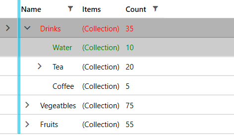

# Modify foreground color of Selected/Hovered row

This help article explains how to change the foreground color of the __TreeListViewRow__ upon selecting it or hovering over it.

## Creating a Style Targeting TreeListViewRow

In order to achieve this you can create a style targeting TreeListViewRow and add triggers that change its __Foreground__ as demonstrated in __Example 1__.

> __Example 1__ uses the WarehouseViewModel and its dependencies defined in the [Getting Started]() article of the RadTreeListView.

#### __[XAML] Example 1: Custom style targeting TreeListViewRow__
{{region xaml-radtreelistview-how-to-modify-foreground-row-0}}

    <Window.DataContext>
        <my:WarehouseViewModel />
    </Window.DataContext>
    <Window.Resources>
        <!-- If you are using the NoXaml binaries, you should base the style on the default one for the theme like so-->
        <!-- 
    </Window.Resources>
    <telerik:RadTreeListView x:Name="radTreeListView" 
                            ItemsSource="{Binding WarehouseItems}">
        <telerik:RadTreeListView.ChildTableDefinitions>
            <telerik:TreeListViewTableDefinition ItemsSource="{Binding Items}" />
        </telerik:RadTreeListView.ChildTableDefinitions>
    </telerik:RadTreeListView>
{{endregion}}

> The demonstrated approach may not be relevant for all UI for WPF themes. 

#### __Figure 1: Result from Example 1 in the Fluent theme__

## See Also
 * [Templates Structure]()