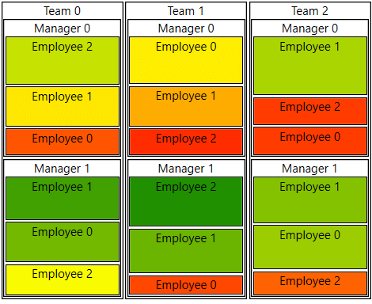

# Getting Start with RadTreeMap

This tutorial will walk you through the creation of a sample application that contains __RadTreeMap__ control.

## Assembly References

In order to use RadTreeMap, you will need to add references to the following assemblies:
* __Telerik.Windows.Controls__
* __Telerik.Windows.Controls.DataVisualization__
* __Telerik.Windows.Data__

You can find the required assemblies for each control from the suite in the [Controls Dependencies]()[Controls Dependencies]() help article.

## Setting up the Data Source

To populate the control with tiles you will need to provide a collection of items that will be assigned to its __ItemsSource__ property. 

For this example we will use a simple hierarchical structure consisting of teams, managers and employees.

#### __[C#] Defining the models__
{{region radtreemap-getting-started-treemap-0}}
	public class Team
    {
        public string Name { get; set; }
        public ObservableCollection<Manager> Managers { get; set; }
        public int ManagersCount
        {
            get { return this.Managers.Count; }
        }
    }

    public class Manager
    {
        public string Name { get; set; }
        public ObservableCollection<Employee> Employees { get; set; }
        public int EmployeesCount
        {
            get { return this.Employees.Count; }
        }
    }

    public class Employee
    {
        public string Name { get; set; }
        public double Salary { get; set; }
    }
{{endregion}}

#### __[C#] Populating a collection with the data__
{{region radtreemap-getting-started-treemap-1}}
	public ObservableCollection<Team> GetData()
	{
		Random r = new Random();            
		var teams = new ObservableCollection<Team>();            
		for (int i = 0; i < 3; i++)
		{
			var team = new Team() { Name = "Team " + i, Managers = new ObservableCollection<Manager>() };               
			for (int k = 0; k < 2; k++)
			{
				var manager = new Manager() { Name = "Manager " + k, Employees = new ObservableCollection<Employee>() };
				int employeesCount = r.Next(3, 6);
				for (int y = 0; y < 3; y++)
				{
					manager.Employees.Add(new Employee() { Name = "Employee " + y, Salary = r.Next(3000, 10000) });
				}                    
				team.Managers.Add(manager);
			}
			teams.Add(team);
		}
		
		return team;
	}
{{endregion}}

## Setting up the RadTreeMap

To set up the control you can set two essential properties - __ItemsSource__ and __TypeDefinitions__. The TypeDefinitions is a collection of TypeDefinition objects which contain information that tells the tree map how to fetch the data from the  objects in the ItemsSource. 

The __ValuePath__ determines the size of the tile.

The __LabelPath__ determines the label that will be displayed over the tile. 

The __TargetTypeName__ contains the class name of the corresponding object in the ItemsSource.

The __ChildrenPath__ is the path to the property that holds the children's collection.

#### __[XAML] Defining RadTreeMap__
{{region radtreemap-getting-started-treemap-2}}
	<telerik:RadTreeMap x:Name="radTreeMap">
		<telerik:RadTreeMap.TypeDefinitions>
			<telerik:TypeDefinition TargetTypeName="Team" ValuePath="ManagersCount" ChildrenPath="Managers" LabelPath="Name" />
			<telerik:TypeDefinition TargetTypeName="Manager" ValuePath="EmployeesCount" ChildrenPath="Employees" LabelPath="Name" />
			<telerik:TypeDefinition TargetTypeName="Employee" ValuePath="Salary" LabelPath="Name">
				<telerik:TypeDefinition.Mappings>
					<telerik:ValueGradientColorizer RangeMinimum="3000" RangeMaximum="10000">
						<GradientStop Offset="0" Color="Red" />
						<GradientStop Offset="0.50" Color="Yellow" />
						<GradientStop Offset="1" Color="Green" />
					</telerik:ValueGradientColorizer>
				</telerik:TypeDefinition.Mappings>
			</telerik:TypeDefinition>               
		</telerik:RadTreeMap.TypeDefinitions>
	</telerik:RadTreeMap>
{{endregion}}

#### __[XAML] Setting the ItemsSource in XAML__
{{region radtreemap-getting-started-treemap-3}}
	<telerik:RadTreeMap ItemsSource="{Binding MyDataSourceProperty}" />
{{endregion}}

#### __[XAML] Setting the ItemsSource in code (see Example 2)__
{{region radtreemap-getting-started-treemap-4}}
	this.radTreeMap.ItemsSource = GetData();
{{endregion}}

__RadTreeMap__  

>tip Avoid inserting RadTreeMap in panels that measure its children with Infinity. In this case, the control cannot properly measure and arrange its child visuals. Examples for panels that measure the control with Inifinity size are StackPanel, ScrollViewer or a Grid's Row/ColumnDefinition with its size (Width or Height) set to Auto. Instead, use panels that measure its children with the available space.

## See Also  
* [Mappings]()
* [Colorizers]()
