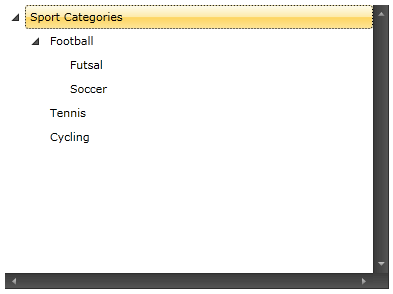

# Enable the Horizontal and Vertical Scrollbars

For example, you may have the following treeview: 

#### __XAML__

{{region radtreeview-how-to-enable-horizontal-vertical-scrollbar_0}}
	<telerik:RadTreeView x:Name="radTreeView">
	    <telerik:RadTreeViewItem Header="Sport Categories">
	        <telerik:RadTreeViewItem Header="Football">
	            <telerik:RadTreeViewItem Header="Futsal"/>
	            <telerik:RadTreeViewItem Header="Soccer"/>
	        </telerik:RadTreeViewItem>
	        <telerik:RadTreeViewItem Header="Tennis"/>
	        <telerik:RadTreeViewItem Header="Cycling"/>
	    </telerik:RadTreeViewItem>
	</telerik:RadTreeView>
{{endregion}}
	

In order to enable horizontal and/or vertical scrollbar you need to add the following attribute(s) to the __RadTreeView__ declaration: 

#### __XAML__

{{region radtreeview-how-to-enable-horizontal-vertical-scrollbar_1}}
	<telerik:RadTreeView x:Name="radTreeView" ScrollViewer.HorizontalScrollBarVisibility="Visible" ScrollViewer.VerticalScrollBarVisibility="Visible">
{{endregion}}

And here is the result: 

The same operation can be done in the code-behind: 

#### __C#__

{{region radtreeview-how-to-enable-horizontal-vertical-scrollbar_2}}
	private void EnableScrollBars()
	{
	    ScrollViewer.SetHorizontalScrollBarVisibility( radTreeView, ScrollBarVisibility.Visible );
	    ScrollViewer.SetVerticalScrollBarVisibility( radTreeView, ScrollBarVisibility.Visible );
	}
{{endregion}}

#### __VB.NET__

{{region radtreeview-how-to-enable-horizontal-vertical-scrollbar_3}}
	Private Sub EnableScrollBars()
	    ScrollViewer.SetHorizontalScrollBarVisibility(radTreeView, ScrollBarVisibility.Visible)
	    ScrollViewer.SetVerticalScrollBarVisibility(radTreeView, ScrollBarVisibility.Visible)
	End Sub
{{endregion}}

If you want to enable the scrollbars __on demand__, you need to set the scrollbars visibility to __Auto__:
	
#### __XAML__
{{region radtreeview-how-to-enable-horizontal-vertical-scrollbar_4}}
	<telerik:RadTreeView x:Name="radTreeView" ScrollViewer.HorizontalScrollBarVisibility="Auto" ScrollViewer.VerticalScrollBarVisibility="Auto">
{{endregion}}
	
#### __C#__
{{region radtreeview-how-to-enable-horizontal-vertical-scrollbar_5}}
	private void EnableScrollBars()
	{
		ScrollViewer.SetHorizontalScrollBarVisibility( radTreeView, ScrollBarVisibility.Auto );
		ScrollViewer.SetVerticalScrollBarVisibility( radTreeView, ScrollBarVisibility.Auto );
	}
{{endregion}}

#### __VB.NET__	
{{region radtreeview-how-to-enable-horizontal-vertical-scrollbar_6}}
	Private Sub EnableScrollBars()
		ScrollViewer.SetHorizontalScrollBarVisibility(radTreeView, ScrollBarVisibility.Auto)
		ScrollViewer.SetVerticalScrollBarVisibility(radTreeView, ScrollBarVisibility.Auto)
	End Sub
{{endregion}}
	
## See Also
 * [Disable Default Animation in RadTreeView]()
 * [Implement Drag and Drop Between TreeView and ListBox]()