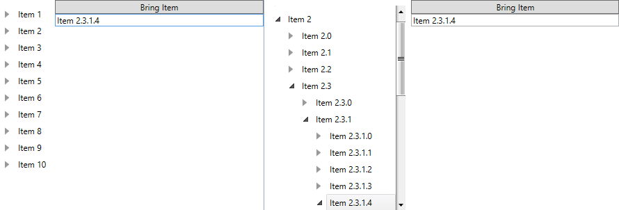

# Expand and Select Item with Load on Demand Enabled RadTreeView

This tutorial will demonstrate you how to __expand__ and __select__ an item when the __RadTreeView__ is in load on demand mode (__IsLoadOnDemandEnabled__ property is set to __True__).

For the purpose of this topic a __RadTreeView__ which is data bound to a business object will be used. The next several code snippets show you the __RadTreeView__ declaration and the business object structure.



#### __XAML__
{{region radtreeview-howto-exapand-select-item-with-lod-enabled-treeview_0}}
	        <Grid>
	            <Grid.Resources>
	                <telerik:HierarchicalDataTemplate x:Key="treeViewTemplate" ItemsSource="{Binding Children}">
	                    <TextBlock Text="{Binding Title}" />
	                </telerik:HierarchicalDataTemplate>
	            </Grid.Resources>
	            <Grid.ColumnDefinitions>
	                <ColumnDefinition Width="Auto" />
	                <ColumnDefinition Width="300" />
	            </Grid.ColumnDefinitions>
	
	            <telerik:RadTreeView x:Name="treeView"
	                             Margin="8"
	                             HorizontalAlignment="Stretch"
	                             IsLoadOnDemandEnabled="True"
	                             IsVirtualizing="True"
	                             ItemTemplate="{StaticResource treeViewTemplate}"
	                             telerik:TextSearch.TextPath="Title" />
	
	            <StackPanel Grid.Column="1"
	                    Width="300"
	                    HorizontalAlignment="Right"
	                    VerticalAlignment="Top">
	                <Button Click="Button_Click_1" Content="Bring Item" />
	                <TextBox x:Name="userInput" />
	            </StackPanel>
	        </Grid>
{{endregion}}




#### __XAML__
{{region radtreeview-howto-exapand-select-item-with-lod-enabled-treeview_22}}
	        <Grid>
	            <Grid.Resources>
	                <HierarchicalDataTemplate x:Key="treeViewTemplate" ItemsSource="{Binding Children}">
	                    <TextBlock Text="{Binding Title}" />
	                </HierarchicalDataTemplate>
	            </Grid.Resources>
	            <Grid.ColumnDefinitions>
	                <ColumnDefinition Width="Auto" />
	                <ColumnDefinition Width="300" />
	            </Grid.ColumnDefinitions>
	
	            <telerik:RadTreeView x:Name="treeView"
	                             Margin="8"
	                             HorizontalAlignment="Stretch"
	                             IsLoadOnDemandEnabled="True"
	                             IsVirtualizing="True"
	                             ItemTemplate="{StaticResource treeViewTemplate}"
	                             telerik:TextSearch.TextPath="Title" />
	
	            <StackPanel Grid.Column="1"
	                    Width="300"
	                    HorizontalAlignment="Right"
	                    VerticalAlignment="Top">
	                <Button Click="Button_Click_1" Content="Bring Item" />
	                <TextBox x:Name="userInput" />
	            </StackPanel>
	        </Grid>
{{endregion}}



The data source for the radtreeview will be consisted of __DataItems__, only.

#### __C#__
{{region radtreeview-howto-exapand-select-item-with-lod-enabled-treeview_1}}
	public class DataItem : ViewModelBase
	    {
	        private string title;
	        private List<DataItem> children;
	
	        public String Title
	        {
	            get
	            {
	                return this.title;
	            }
	            set
	            {
	                if (this.title != value)
	                {
	                    this.title = value;
	                    this.OnPropertyChanged("Title");
	                }
	            }
	        }
	
	        public List<DataItem> Children
	        {
	            get
	            {
	                return this.children;
	            }
	        }
	    }
{{endregion}}

#### __VB.NET__
{{region radtreeview-howto-exapand-select-item-with-lod-enabled-treeview_2}}
	Public Class DataItem
	        Inherits ViewModelBase
	        Private m_title As String
	        Private m_children As List(Of DataItem)
	
	        Public Property Title() As [String]
	            Get
	                Return Me.m_title
	            End Get
	            Set(value As [String])
	                If Me.m_title <> value Then
	                    Me.m_title = value
	                    Me.OnPropertyChanged("Title")
	                End If
	            End Set
	        End Property
	
	        Public ReadOnly Property Children() As List(Of DataItem)
	            Get
	                Return Me.m_children
	            End Get
	        End Property
	    End Class
{{endregion}}

Set a __DataItem__ instance to the __ItemsSource__ property of the __RadTreeView__ and create some simple data like in the code snippet below.        

#### __C#__
{{region radtreeview-howto-exapand-select-item-with-lod-enabled-treeview_3}}
	this.treeView.ItemsSource = Enumerable.Range(1, 10).Select(i => new DataItem()
	{
	    Title = string.Format("Item {0}", i)
	}).ToList();
{{endregion}}

The actual loading on demand of the business items can be implemented in the getter of the __Children__ property of the __DataItem__ class. The LoadOnDemand feature of the RadTreeView control is used to visualize the expander icon in the front of each RadTreeViewItem. We do not use the built-in LoadOnDemand event to load the business items into the control. Instead the HierarchicalDataTemplate will trigger the getter of its ItemsSource property whenever the expander is clicked. For demonstration purposes we will load fixed number of business data every time the getter is triggered and the __children__ field is not yet instantiated.

#### __C#__
{{region radtreeview-howto-exapand-select-item-with-lod-enabled-treeview_16}}
	public List<DataItem> Children
	{
	    get
	    {
	        if (this.children == null)
	        {
	            this.children = new List<DataItem>();
	            for (int i = 0; i < 5; i++)
	            {
	                DataItem item = new DataItem() { Title = string.Format("{0}.{1}", this.Title, i) };
	                this.children.Add(item);
	            }
	        }
	        return this.children;
	    }
	}
{{endregion}}

#### __VB.NET__
{{region radtreeview-howto-exapand-select-item-with-lod-enabled-treeview_17}}
	Public ReadOnly Property Children() As List(Of DataItem)
	        Get
	            If Me.children Is Nothing Then
	                Me.children = New List(Of DataItem)()
	                For i As Integer = 0 To 4
					Dim item As New DataItem() With { _
						Key .Title = String.Format("{0}.{1}", Me.Title, i) _
					}
	                    Me.children.Add(item)
	                Next
	            End If
	            Return Me.children
	        End Get
	    End Property
{{endregion}}

The next step is to implement the custom logic for creating the path in order to use the [BringPathIntoView()]() method.

#### __C#__
{{region radtreeview-howto-exapand-select-item-with-lod-enabled-treeview_18}}
	private void Button_Click_1(object sender, RoutedEventArgs e)
	{
	    string[] headerAndIndexes = this.userInput.Text.Split(' ');
	    string[] indexes = headerAndIndexes.LastOrDefault().Split('.');
	    bool areIndexesValid = false;
	    int i;
	
	    if (headerAndIndexes != null && indexes != null)
	    {
	        foreach (string index in indexes)
	        {
	            areIndexesValid = int.TryParse(index, out i);
	        }
	
	        if (headerAndIndexes.FirstOrDefault().Contains("Item") && areIndexesValid)
	        {
	            RadTreeViewItem item = this.treeView.GetItemByPath(this.GenetatePath(this.userInput.Text));
	            if (item != null)
	            {
	                item.IsSelected = true;
	                item.IsExpanded = true;
	            }
	        }
	    }
	}
	  
	private string GenetatePath(string itemToExpand)
	{
	    string path = string.Empty;
	    string buffer;
	    string[] header = itemToExpand.Split(' ');
	    string[] indexes = header.LastOrDefault().Split('.');
	
	    header[0] = string.Format("{0} {1}", header[0], indexes[0]);
	    path = string.Format("{0}\\", header[0]);
	
	    for (int i = 1; i < indexes.Length; i++)
	    {
	        buffer = string.Format("{0}.{1}", header[0], indexes[i]);
	        header[0] = buffer;
	        path += string.Format("{0}\\", buffer);
	    }
	    return path.TrimEnd('\\');
	}
{{endregion}}

#### __VB.NET__

{{region radtreeview-howto-exapand-select-item-with-lod-enabled-treeview_19}}
	
	    Private Sub Button_Click_1(sender As Object, e As RoutedEventArgs)
	        Dim headerAndIndexes As String() = Me.userInput.Text.Split(" "c)
	        Dim indexes As String() = headerAndIndexes.LastOrDefault().Split("."c)
	        Dim areIndexesValid As Boolean = False
	        Dim i As Integer
	
	        If headerAndIndexes IsNot Nothing AndAlso indexes IsNot Nothing Then
	            For Each index As String In indexes
	                areIndexesValid = Integer.TryParse(index, i)
	            Next
	
	            If headerAndIndexes.FirstOrDefault().Contains("Item") AndAlso areIndexesValid Then
	                Dim item As RadTreeViewItem = Me.treeView.GetItemByPath(Me.GenetatePath(Me.userInput.Text))
	                If item IsNot Nothing Then
	                    item.IsSelected = True
	                    item.IsExpanded = True
	                End If
	            End If
	        End If
	    End Sub
	
	    Private Function GenetatePath(itemToExpand As String) As String
	        Dim path As String = String.Empty
	        Dim buffer As String
	        Dim header As String() = itemToExpand.Split(" "c)
	        Dim indexes As String() = header.LastOrDefault().Split("."c)
	
	        header(0) = String.Format("{0} {1}", header(0), indexes(0))
	        path = String.Format("{0}\", header(0))
	
	        For i As Integer = 1 To indexes.Length - 1
	            buffer = String.Format("{0}.{1}", header(0), indexes(i))
	            header(0) = buffer
	            path += String.Format("{0}\", buffer)
	        Next
	        Return path.TrimEnd("\"c)
	    End Function
{{endregion}}

The final result after bringing *Item 2.3.1.4* should look like this

## See Also
 * [Get Item by Path]()
 * [Selection]()
 * [Get Previous, Next, Parent and Sibling Node of a Specific TreeView Item]()