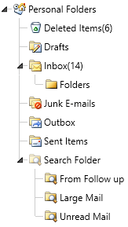

# Overview



Thank you for choosing Telerik __RadTreeView__!		

Do you have need of building complicated navigation systems which perform with the speed of light? With __RadTreeView__ you can achieve all of this and much more. With its powerful databinding and load on demand mechanism, the control lets you display hierarchical structures, such as directories and relational data. With its drag and drop functionality and other advanced capabilities, __RadTreeView__ significantly improves the navigation and performance of your application.

## Key Features

This is a list with short descriptions of the top-of-the-line features of Telerik's __RadTreeView__ control.

* __Powerful DataBinding to Objects, Collections, XML and WCF services__: Binding RadTreeView is as simple as setting a single property. The binding sources which the treeview supports include Objects, XML, WCF services. Read more about this in the [Data binding]() section.

* __Load on Demand__: The performance of the RadTreeView control when operating with huge amount of items is significantly optimized through its load on demand feature. This mechanism lets the nodes load their child nodes as the user expands the parent by clicking on the expand icon. Read more about this in the [Load on Demand]() article.

* __Drag and Drop Behavior__: The RadTreeView control enhances further your application’s capabilities through the rich drag-and-drop functionality. Your users can create and re-order any hierarchical structures and easily perform the following drag-and-drop operations: drag and drop onto another node or between two nodes; drag and drop between treeviews; drag and drop multiple nodes. Read more about this in the [Drag and Drop]() article.

* __UI Virtualization__: The RadTreeView API supports UI Virtualization, which processes only information loaded in the viewable area, which reduces the memory footprint of the application and speeds up loading time thus enhancing additionally the UI performance. Read more about this in the [UI Virtualization]() article.

* __BringIntoView Support__: The RadTreeView API offers BringIntoView support, which brings the provided item into view. Read more about this in the [BringIntoView Support]() article.

* __Styling and Appearance__: The control ships with several pre-defined themes that can be used to style the treeview control. Furthermore, Telerik's unique style building mechanism allows you to change the skin’s color scheme with just a few clicks. Read more about this in the [Styles and Templates]() section.

* __Keyboard Support__: Navigate through the nodes of the treeview without using the mouse. The keyboard can entirely replace the mouse by allowing you to perform navigation, editing, expanding, collapsing and selecting the nodes. Read more about this in the [Keyboard Support]() article.

* __Lines Support__: You can easily show/hide the connecting lines between the nodes by simply setting a single property. Read more about this in the [Lines Support]() article.

* __Item Editing__: RadTreeView supports editing the displayed text of the item. Read more about this in the [Item Editing]() article.

* __Item Images__: RadTreeView gives you the ability to define images for each item state (default, expanded, collapsed). Read more about this in the [Item Images]() article.

* __Expanding and Collapsing Items__: RadTreeView gives you the ability to expand and collapse items with your mouse, programmatically, recursively or just expanding a single branch of the treeview. Read more about this in the [Expanding and Collapsing Items]() article.

* __Multi-node Selection__: The treeview let users to select multiple nodes by simply setting a single property. Read more about this in the [Selection]() article.

* __UI Automation Support__: As the {{ site.framework_name }} platform exposes a full accessibility tree through UIA(UI Automation), Telerik __UI for {{ site.framework_name }}__ fully support UI Automation for UI elements access/manipulation, screen readers and other accessibility tools. Read more about this in the [UI Automation Support]() article.

* __Expression Blend Support__: All __UI for {{ site.framework_name }}__ controls can be easily customized using Expression Blend.


* __Enhanced Routed Events Framework__: To help your code become even more elegant and concise, we have implemented Enhanced Routed Events Framework for __UI for Silverlight__. This gives you more freedom when you design your applications, since you can write instance handlers as well as class handlers for the routed events of our controls.


>tip Get started with the control with its [Getting Started]() help article that shows how to use it in a basic scenario.

> Check out the control demos at [demos.telerik.com](https://demos.telerik.com/silverlight/#TreeView/FirstLook)[demos.telerik.com](https://demos.telerik.com/wpf/)

## See Also

* [Visual Structure]()
* [Getting Started]()
* [Styles and Templates]()
* [Events]()
* [Populating with Data]()
