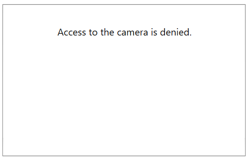

# Events

__RadWebCam__ exposes the following events, specific for the control.

## SnapshotTaken

The SnapshotTaken event fires when the "Take snapshot" button is pressed or when you call the __TakeSnapshot__ method of RadWebCam.

The purpose of the event is to notify you that a snapshot has been taken and you need to take action, like saving it to a file.

The event arguments are of type __SnapshotTakenEventArgs__ which exposes a __Snapshot__ property (of type BitmapSource).

#### __[C#] Example 1: Subscribing to the SnapshotTaken event__
{{region radwebcam-events-0}}
	public MainWindow()
	{
		InitializeComponent();		
		this.radWebCam.SnapshotTaken += RadWebCam_SnapshotTaken;
	}

	private void RadWebCam_SnapshotTaken(object sender, SnapshotTakenEventArgs e)
	{
		BitmapSource snapshot = e.Snapshot;
		// here you save the source to a file, in memory, or to show it in the UI
	}
{{endregion}}

## CameraError

The __CameraError__ event fires when one of the [expected camera errors](#error-types) appears.

The event can be used to notify you about the corresponding error, or to replace the error message shown in the control.

The event arguments are of type __CameraErrorEventArgs__ and they expose an __Error__ property that contains information about the error. The Error property is of type __ErrorInfo__ which gives you access to the message and state of the error via the __Message__ and __ErrorState__ properties.

#### __[C#] Example 2: Subscribing to the CameraError event and replacing the no-camera error message__
{{region radwebcam-events-1}}
	public MainWindow()
	{
		InitializeComponent();
		this.radWebCam.CameraError += RadWebCam_CameraError;
	}

	private void RadWebCam_CameraError(object sender, RoutedEventArgs e)
	{
		var args = (CameraErrorEventArgs)e;
		if (args.Error.ErrorState == CameraErrorState.NoCamera)
		{
			args.Error.Message = "Cannot detect a camera device.";
		}           
	}
{{endregion}}

#### Figure 1: Customized error message

## RecordingStarted/Ended

The __RecordingStarted__ and __RecordingEnded__ events fire when the camera control starts and ends recording a video. Read more about the video capturing in the [Recording Video]() article.

## See Also  
* [Getting Started]()
* [Visual Structure]()
* [Snapshots]()
* [Errors]()
