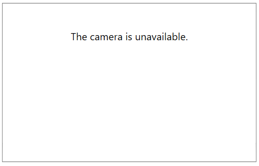
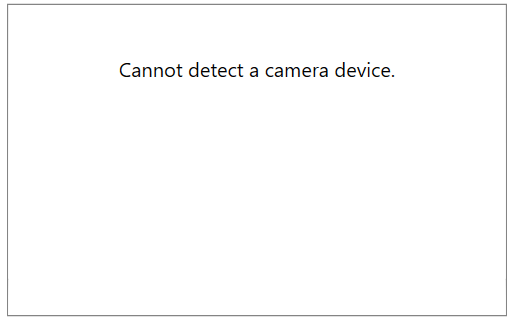

# Errors

This article demonstrates how to customize the error content shown when one of the few known camera errors appear. 

When one of the following errors appear, the camera buttons and player get replaced by an error message presenter.

## Error Types

There are few expected errors that could appear using the control.

* __No camera detected__. This error appears when there is no camera device connected to the computer.

	
	
* __The camera is unavailable__. This error appears when another application is using the camera device.

	
	
* __Video adapter does not support the D3DFMT_X8R8G8B8 format__. This error appears when the hardware that runs the RadWebCam control doesn't support the camera rendering engine.

	
	
## Replacing the Error Message
	
To replace the error message use the __CameraError__ event of RadWebCam. The __CameraErrorEventArgs__ give access to an __ErrorInfo__ object, which contains information about the error state and message. Use the event to replace the default message with a custom one.

#### __[C#] Example 1: Replacing the no-camera error message__
{{region radwebcam-features-errors-0}}
	public MainWindow()
	{
		InitializeComponent();
		this.radWebCam.CameraError += RadWebCam_CameraError;
	}

	private void RadWebCam_CameraError(object sender, RoutedEventArgs e)
	{
		var args = (CameraErrorEventArgs)e;
		if (args.Error.ErrorState == CameraErrorState.NoCamera)
		{
			args.Error.Message = "Cannot detect a camera device.";
		}           
	}
{{endregion}}

#### Figure 1: Customized error message

## Customizing the Error Content Template

By default the error message is displayed in a simple content presenter. To customize this, use the __CameraErrorContentTemplate__ property of RadWebCam.

#### __[XAML] Example 2: Customizing the error template__
{{region radwebcam-features-errors-1}}
	<telerik:RadWebCam>
		<telerik:RadWebCam.CameraErrorContentTemplate>
			<DataTemplate>
				<TextBlock Text="{Binding Message}" 
						   Background="#5D6B99" 
						   Foreground="White"
						   Padding="10" />
			</DataTemplate>
		</telerik:RadWebCam.CameraErrorContentTemplate>
	</telerik:RadWebCam>
{{endregion}}

#### Figure 2: Custom error template

## See Also  
* [Getting Started]()
* [Recording Video]()
* [Events]()
