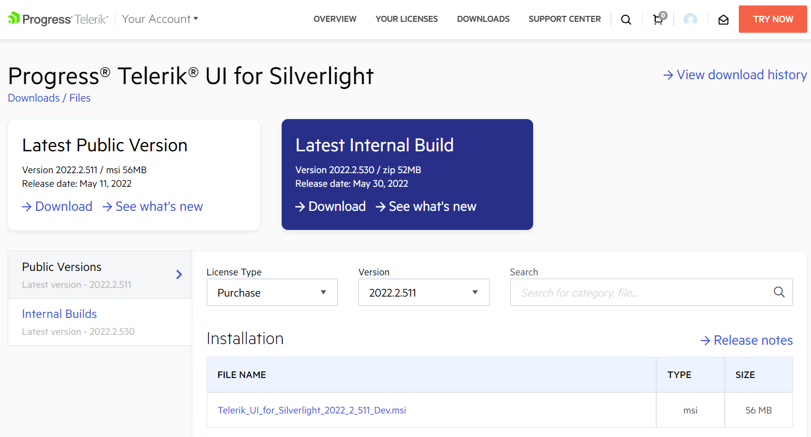
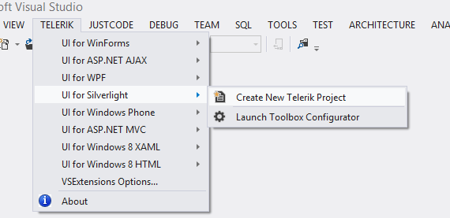
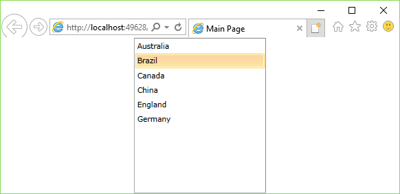

# First Steps with Telerik UI for Silverlight

This article explains how to get the Telerik UI for {{ site.framework_name }} controls in your project and start using them quickly.

Once you have your first simple control up and running, take a look at the [next steps](#next-steps) section to start exploring the control functionality in more detail.

## Download the Controls

The easiest way to get the controls to your development machine is to use the [Progress Control Panel](https://www.telerik.com/download-trial-file/v2/control-panel) or to download the [automated MSI installer]() from [your telerik.com account](https://www.telerik.com/account/product-download?product=RCSL).

>caption Figure 1: Download automated (.msi) installer

> If you are not a customer, you can [download a free, fully functional trial](https://www.telerik.com/download-trial-file/v2-b/ui-for-silverlight) and the same options will apply to you as well.

>tip The following article can help you choose the installation type that is most suitable for your needs and preferences: [Which File Do I Need to Install]().

## Create a UI for {{ site.framework_name }} Project

The easiest way to create a Telerik UI for {{ site.framework_name }} project is to use **Visual Studio Extensions** which are distributed with the Telerik UI for {{ site.framework_name }} installer.

The Visual Studio Extensions can be accessed through the Telerik | Telerik UI for {{ site.framework_name }} menu which has different menu items depending on the selected project in Visual Studio. The extensions can be accessed through the context menu of a {{ site.framework_name }} Application as well.

You can then create the Telerik UI for {{ site.framework_name }} project in one of the 3 following ways:

* If you **do not have a project**, run the [Create Project Wizard]().
>caption Figure 2: Go to Telerik > Telerik  UI for {{ site.framework_name }} > Create New Telerik Project

* If you already **have a {{ site.framework_name }} project**, run the [Convert Project Wizard]().
>caption Figure 3: Go to Telerik > Telerik UI for {{ site.framework_name }} > Convert to Telerik {{ site.framework_name }} Application

* If you prefer full manual control over your project, you can **copy** the **Telerik assemblies** to the **~/bin** and **add references** to them through the Visual Studio interface. The controls come packaged in several assemblies but to get started, you only need **Telerik.Windows.Controls.dll**.

## Add a Teleik Control to the Project

The final step is to actually [add a Telerik control to your application]().

1. [Add the Telerik namespace]().

	#### __[XAML] Example 1: Telerik namespace definition__

	{{region installation-adding-application-namespace-declaration-0}}
		xmlns:telerik="http://schemas.telerik.com/2008/xaml/presentation" 
	{{endregion}}

2. **Add a Telerik control** to the page, for example, a [RadListBox]():

	#### __[XAML] Example 2: Adding RadListBoxItems__
	{{region xaml-radlistbox-getting-started_1}}
		<telerik:RadListBox  Width="200" x:Name="radListBox">
			<telerik:RadListBoxItem Content="Australia" />
			<telerik:RadListBoxItem Content="Brazil" />
			<telerik:RadListBoxItem Content="Canada" />
			<telerik:RadListBoxItem Content="China" />
			<telerik:RadListBoxItem Content="England" />
			<telerik:RadListBoxItem Content="Germany" />
		</telerik:RadListBox>
	{{endregion}}

	> You can also **drag** a control **from** the **Visual Studio Toolbox**. If you do not see the controls in the toolbox, examine the [Adding the Telerik Controls to the Visual Studio Toolbox]() article.

3. **Run the project** by pressing **F5**. You should see something like this:

	>caption Figure 4: The final result

	

## Next Steps

Now that you have the Telerik UI for {{ site.framework_name }} controls running in your project, you may want to explore their features, customize their behavior or change their appearance. Below you can find guidance on getting started with such tasks:

* [Explore control features]()
* [Change control appearance]()
* [Further information]()

## See Also

* [System Requirements]()
* [Download Product Files]()
* [Progress Virtual Classroom](https://www.telerik.com/account/support/virtual-classroom)