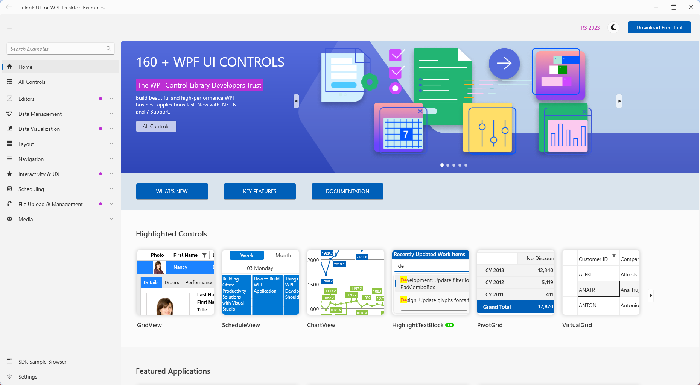
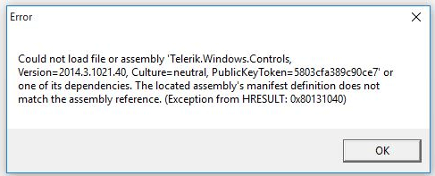

# Installing WPF Demos Application

__Telerik WPF Demos application__ provides a rich list of examples showcasing all the important features of Telerik UI for WPF.

In this topic we will go through the following sections:

* [How to Run WPF Demos Application](#how-to-run-wpf-demos-application)

* [How to Get the Source Code](#how-to-get-the-source-code)

* [Common Issues](#common-issues)

## How to Run WPF Demos Application

WPF Demos application could be accessed from the following link: [https://demos.telerik.com/wpf/](https://demos.telerik.com/wpf/)

You can also download the application from the Windows Store: 

As it is deployed as a ClickOnce application it requires the following components in order to be installed and run locally:

* Windows Installer 4.5 

* Microsoft .NET Framework 4.5

* SQL Server 2008 SP3 Express or newer **(not required with R3 2017 SP1 and later)**

>tip If these components are already installed, you can [launch](https://demos.telerik.com/wpf/WPF%20Demos.application) the application. Note that lauching the ClickOnce application (via the launch hyperlink) is possible only in Internet Explorer. Otherwise, you will need to [install](https://demos.telerik.com/wpf/setup.exe) the prerequisites before running the application. As a result the demos will be deployed on your computer and you will be able to run them locally.

>important If you have a previous installation of WPF Demos, make sure to uninstall it before installing a newer version.

## How to Get the Source Code

Visual Studio solution containing the source code of the examples is available in the Telerik UI for WPF download page inside your Telerik account. Follow the next steps in order to download it:

1. Go to your [account page at telerik.com](https://www.telerik.com/account/) and log in, if necessary.

2. Click on the __DOWNLOADS__ button. This will open the list with all available products for your account.

	

3. Click on the __Progress Telerik UI for WPF__ item in the products list. This will open the page with all available downloads for the WPF product.

	

4. Find the __Telerik_UI_for_WPF_[version]_Demos.zip__ file and click on it in order to download the .zip.

	

5. Unzip the file and run the __ExamplesCS_WPF.sln__ file.

	

>tip The source code .zip does not contain the assemblies so that it is smaller in size. Building and running the demos solution locally requires to have a local installation of Telerik UI for WPF suite with the same version as the downloaded demos. 

## Common Issues

In this section we will review the most common issues experienced when running the WPF Demos application.

### "Could not load file or assembly" error when running an example from the demos application

Issues like this are caused by cached files left from a previous installation. As the WPF Demos is a ClickOnce application, we generally recommend fully uninstalling it before installing a newer version. Sometimes you might also need to manually delete the folders, if there are such left, after uninstalling the application and clearing the application cache. By default the files of the application are stored under the following directory: `C:\Users\\&lt;your_user&gt;\AppData\Local\Apps\2.0`	

### SQL version mismatch **(not relevant with R3 2017 SP1 and later)**

If you receive an error about the SQL version, for example:

`Prerequisite check for system component SQL Server 2008 Express failed with the following error message: "SQL Server 2008 Express Service Pack 1 (x64) cannot upgrade the existing instance of SQL Server 2005 Express (x64 WoW) named 'SQLEXPRESS'. Uninstall this instance of SQL Server 2005 Express and retry installing SQL Server 2008 Express Service Pack 1 (x64)."`

You should either uninstall the older SQL Server or change the instances names, so that the default “SQLEXPRESS” refers to the SQL Server 2008 Express.

### Receiving a System.Deployment.Application.InvalidDeploymentException

This exception is thrown when trying to open a ClickOnce application in a browser different than Internet Explorer. In order to open a ClickOnce application in another browser, you can look for an extension in the corresponding browser store. 

## See Also  
 * [Installing Telerik UI for WPF from MSI File]()
 * [Installing Telerik UI for WPF from ZIP File]()
 * [Latest Internal Build]()
