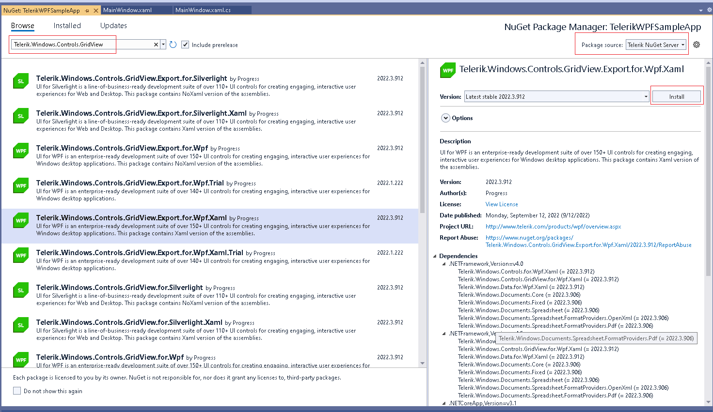

# Setting NuGet Package Source

The Telerik NuGet packages are available as `.nupkg` files that can be downloaded in a local package source, and also can be installed from the online Telerik NuGet server. 

## Using the Telerik NuGet Server as Package Source

The Telerik server is an online package source that can be accessed through Visual Studio's Nuget Package Manager in order to easily install and upgrade Telerik assemblies. The NuGet server resides at: [https://nuget.telerik.com/v3/index.json](https://nuget.telerik.com/v3/index.json). 

> The old https://nuget.telerik.com/nuget server will be deprecated and we encourage our clients to switch to the v3 API. The new v3 API is faster, lighter, and reduces the number of requests from NuGet clients.

The following steps show how to setup the package source in Visual Studio. 

1. Navigate to the Package Manager Settings menu in Visual Studio.
	
	

1. Add a new source in the Package Sources section.

	
	
1. In the Source field fill the address of the Telerik NuGet Server and click OK. The address is: [https://nuget.telerik.com/v3/index.json](https://nuget.telerik.com/v3/index.json)

	
	
1. The Telerik Server is added and ready to use. 

Selecting the Telerik's source as the __Package source__ in Visual Studio will prompt you to enter your __telerik.com credentials__ (email and password).

Using this approach you can only use versions from __2016.3.1024 and later__. If you need to use a previous version of the suite you will need to create a [local package source](#using-a-local-package-source).

## Using a Local Package Source

The Telerik packages are available as `.nupkg` files that can be downloaded from your telerik.com account. The following steps describe what to download and how to setup the package source:

1. Go to the [UI for WPF Downloads](https://www.telerik.com/account/product-download?product=RCWPF) page.
1. Download the .zip file with the NuGet packages and extract it into the folder where your package source will be hosted.

	You will find 4 .zip files with nuget packages on the download page. These contains two different package types (full and separate) each containing two different types of Telerik dlls ([Xaml and NoXaml]()).
	
	* `Telerik_UI_for_WPF_{version}NuGet{Xaml/NoXaml}_Dev.zip` are available for the supported .NET versions and combine all UI for WPF assemblies in one NuGet.
	* `Telerik_UI_for_WPF_{version}NuGet_Separate_Packages{Xaml/NoXaml}_Dev.zip` contains the separate NuGet packages of all UI for WPF assemblies. These are useful if you don't want to include all Telerik assemblies in your project, but only the ones you are referencing.	
	
1. Navigate to the "Package Manager Settings" menu.
	
	

1. Add a new source in the "Package Sources" section.

	
	
1. In the "Source" field use the path to the folder where you extracted the .zip file with the .nupkg files (step 2). Then click OK.

	

1. The Telerik server is added and ready to use. 

## Selecting the Package Source in Visual Studio

Once you created the package source as described in the previous sections of this article, you will need to select it in the Visual Studio's NuGet Package Manager.

1. Open your project in Visual Studio and select it.
1. Click on the "Manage NuGet Packages" menu.
1. Select the source from the "Package source" drop down.
	
	

1. Search and install a package.

Selecting the Telerik's source as the __Package source__ in Visual Studio will prompt you to enter your __telerik.com credentials__ (email and password).

## See Also  
* [Available NuGet Packages]()
