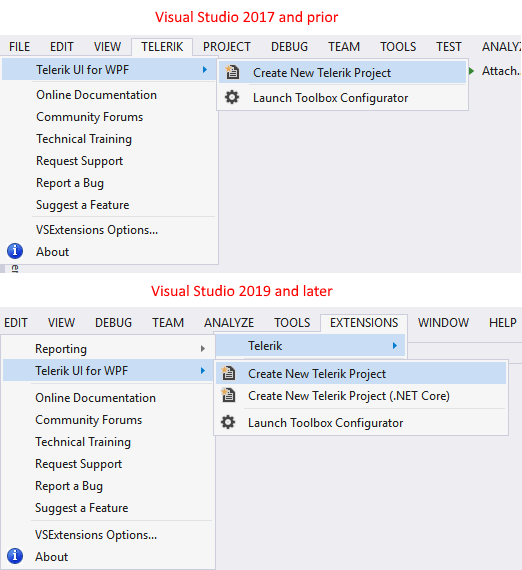
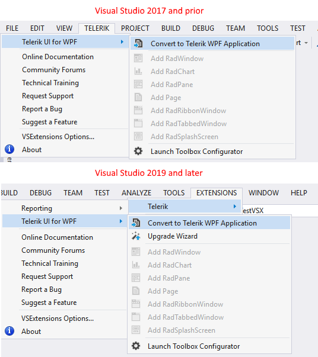
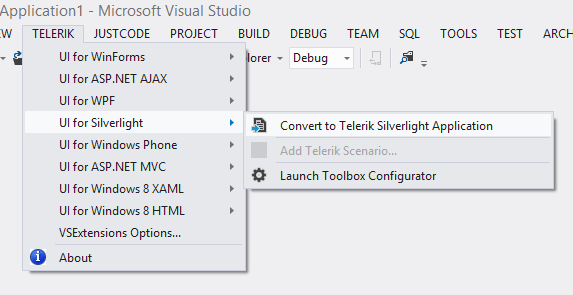
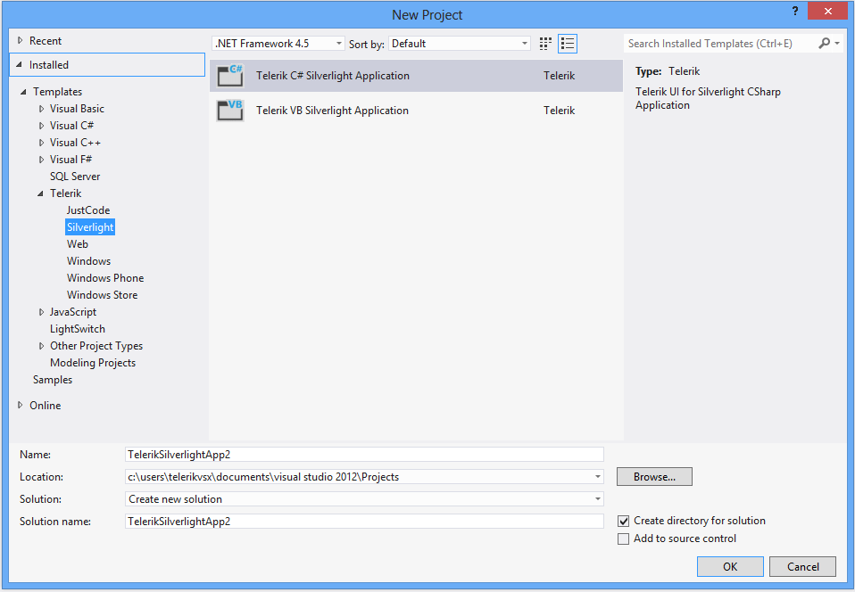

# Overview

__Progress Telerik UI for {{ site.framework_name }} Extension__ aim to help developers when creating an application with Telerik UI for {{ site.framework_name }}.

The extensions handle the following major points in the development with Telerik UI for {{ site.framework_name }}:

* __Project creation, conversion and configuration__: Reference management.

* __Project upgrade__: Upgrading Telerik UI for {{ site.framework_name }} to a new version.

* __Common scenario page creation__: Aid creating pages with basic scenarios in the usage of Telerik UI for {{ site.framework_name }}.

* __Toolbox configuration__: Select what version of Telerik UI for {{ site.framework_name }} to be populated in the Visual Studio Toolbox.

__Progress Telerik UI for {{ site.framework_name }} Extension__ is distributed with the Telerik UI for WPF {{ site.framework_name }} installer. It can be downloaded and installed as separate product from the [Visual Studio Gallery](https://marketplace.visualstudio.com/) for Visual Studio 2012 and later. The extension supports Visual Studio 2012, 2013, 2015, 2017 and 2019, and it handles .NET 4.0+ applications.

Progress Telerik UI for {{ site.framework_name }} Extension can be accessed through the __Telerik | Telerik UI for WPF__ menu in versions prior to Visual Studio 2019 and in the __Extensions | Telerik | Telerik UI for {{ site.framework_name }}__ in Visual Studio 2019. The extensions show  different menu items depending on the selected project in Visual Studio. The extensions can be accessed through the context menu of the application as well.

#### Figure 1: No selected project in Visual Studio







#### Figure 2: Selected project in Visual Studio is Standard WPF Application


#### Figure 2: Selected project in Visual Studio is Standard Silverlight Application



#### Figure 3: Selected project in Visual Studio is Telerik Application






When installed, the extensions add several project templates to the New Project dialog of Visual Studio.

#### Figure 4: Telerik project templates







>These are available in the language specific nodes of the dialog as well. New Project dialog contains Telerik WPF Application under both CSharp\Windows and Visual Basic\Windows nodes.

>These are available in the language specific nodes of the dialog as well. New Project dialog contains Telerik Silverlight Application under both CSharp\Silverlight and Visual Basic\Silverlight nodes.

