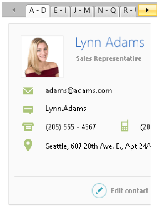

## Environment
<table>
    <tbody>
	    <tr>
	    	<td>Product Version</td>
	    	<td>2019.2.510</td>
	    </tr>
	    <tr>
	    	<td>Product</td>
	    	<td>RadTabControl for WPF</td>
	    </tr>
    </tbody>
</table>

## Description

How to change the width of the scroll buttons that are shown when the OverflowMode property of RadTabControl set to Scroll.

## Solution

Get the RepeatButton controls representing the scroll buttons. Then set their Width. To do this, subscribe to the Loaded event of RadTabControl and use the [ChildrenOfType<T>()]() method to get the buttons.

#### __[C#]__
{{region kb-tabcontrol-resize-scroll-buttons-width-0}}
	private void RadTabControl_Loaded(object sender, RoutedEventArgs e)
	{
		var tabControl = (RadTabControl)sender;
		var scrollButtons = tabControl.ChildrenOfType<RepeatButton>();
		var leftButton = scrollButtons.FirstOrDefault(x => x.Name == "LeftScrollButtonElement");
		var rightButton = scrollButtons.FirstOrDefault(x => x.Name == "RightScrollButtonElement");
	 
		leftButton.Width = 30;
		rightButton.Width = 30;
	}
{{endregion}}

