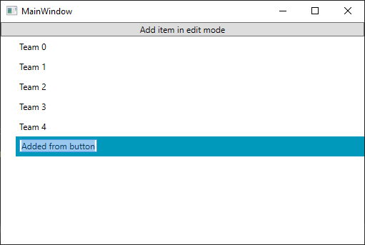

## Environment
<table>
	<tbody>
		<tr>
			<td>Product</td>
			<td>RadTreeView for WPF</td>
		</tr>
	</tbody>
</table>

## Description

How to allow the user to edit an item that is added to the RadTreeView. 

## Solution

Make sure that the __IsInEditMode__ property of the item is set to True after the RadTreeViewItem is __loaded__. __Examples 1 and 2__ demonstrate how you can achieve that in an MVVM scenario.

__Example 1__ demonstrates a sample implementation of a model and a viewmodel that contains a collection of models as well as a command for adding new items. 

#### __[C#] Example 1: The Model and ViewModel__
{{region cs-kb-treeview-add-item-in-edit-mode-0}}
	public class Team : ViewModelBase
	{
        private string name = "";
        private bool isInEditMode;

        public string Name
        {
            get { return this.name; }
            set
            {
                if (this.name != value)
                {
                    this.name = value;
                    this.OnPropertyChanged("Name");
                }
            }
        }

        public bool IsInEditMode
        {
            get
            {
                return this.isInEditMode;
            }
            set
            {
                if (this.isInEditMode != value)
                {
                    this.isInEditMode = value;
                    this.OnPropertyChanged("IsInEditMode");
                }
            }
        }

        public static ObservableCollection<Team> GetTeams()
        {
            var teams = new ObservableCollection<Team>();

            for (int i = 0; i < 5; i++)
            {
                teams.Add(new Team() { Name = "Team " + i });

            }

            return teams;
        }
    }

    public class ViewModel
    {
        private ObservableCollection<Team> teams;

        public ViewModel()
        {
            this.AddItemCommand = new DelegateCommand(OnAddItem);
        }

        public DelegateCommand AddItemCommand { get; }

        public ObservableCollection<Team> Teams
        {
            get
            {
                if (this.teams == null)
                {
                    this.teams = Team.GetTeams();
                }

                return this.teams;
            }
        }

        private void OnAddItem(object obj)
        {
            var itemToAdd = new Team() { Name = "Added from button" };
            this.Teams.Add(itemToAdd);

            // We need to make sure that the new item is loaded before it enters edit mode
            Dispatcher.CurrentDispatcher.BeginInvoke(new Action(() =>
            {
                itemToAdd.IsInEditMode = true;
            }), DispatcherPriority.Loaded);
        }
    }
{{endregion}}

#### __[VB.NET] Example 1: The Model and ViewModel__
{{region vb-kb-treeview-add-item-in-edit-mode-1}}
	Public Class Team
        Inherits ViewModelBase

        Private _name As String = ""
        Private _isInEditMode As Boolean

        Public Property Name() As String
            Get
                Return Me._name
            End Get
            Set(ByVal value As String)
                If Me._name <> value Then
                    Me._name = value
                    Me.OnPropertyChanged("Name")
                End If
            End Set
        End Property

        Public Property IsInEditMode() As Boolean
            Get
                Return Me._isInEditMode
            End Get
            Set(ByVal value As Boolean)
                If Me._isInEditMode <> value Then
                    Me._isInEditMode = value
                    Me.OnPropertyChanged("IsInEditMode")
                End If
            End Set
        End Property

        Public Shared Function GetTeams() As ObservableCollection(Of Team)
            Dim teams = New ObservableCollection(Of Team)()

            For i As Integer = 0 To 4
                teams.Add(New Team() With {.Name = "Team " & i})

            Next i

            Return teams
        End Function
    End Class

    Public Class ViewModel
        Private _teams As ObservableCollection(Of Team)

        Public Sub New()
            Me.AddItemCommand = New DelegateCommand(AddressOf OnAddItem)
        End Sub

        Public ReadOnly Property AddItemCommand() As DelegateCommand

        Public ReadOnly Property Teams() As ObservableCollection(Of Team)
            Get
                If Me._teams Is Nothing Then
                    Me._teams = Team.GetTeams()
                End If

                Return Me._teams
            End Get
        End Property

        Private Sub OnAddItem(ByVal obj As Object)
            Dim itemToAdd = New Team() With {.Name = "Added from button"}
            Me.Teams.Add(itemToAdd)

            ' We need to make sure that the new item is loaded before it enters edit mode
            Dispatcher.CurrentDispatcher.BeginInvoke(New Action(Sub()
                itemToAdd.IsInEditMode = True
            End Sub), DispatcherPriority.Loaded)
        End Sub
    End Class

    
{{endregion}}

__Example 2__ shows how the RadTreeView is setup. Note, that the __ItemEditTemplate__ is set along with a style binding the IsInEditMode property of the RadTreeViewItem to the property in our model. 

#### __[XAML] Example 2: The view__
{{region xaml-kb-treeview-add-item-in-edit-mode-2}}

    <Grid>
        <Grid.DataContext>
            <local:ViewModel />
        </Grid.DataContext>
        <Grid.Resources>
            <DataTemplate x:Key="ItemEditTemplate">
                <TextBox Text="{Binding Name}" />
            </DataTemplate>
            
            <!-- If you are using the NoXaml dlls, you should base the style on the default one for the theme like so-->
            <!-- 
        </Grid.Resources>
        <Grid.RowDefinitions>
            <RowDefinition Height="Auto"/>
            <RowDefinition />
        </Grid.RowDefinitions>
        
        <Button Content="Add item in edit mode" Command="{Binding AddItemCommand}" />
        <telerik:RadTreeView Grid.Row="1"
                            ItemEditTemplate="{StaticResource ItemEditTemplate}"
                            IsEditable="True"
                            IsVirtualizing="True"
                            DisplayMemberPath="Name"
                            ItemsSource="{Binding Teams}">
        </telerik:RadTreeView>
	</Grid>
{{endregion}}

#### __Figure 1: Result after the add button is clicked in the Fluent theme__

## See Also

* [How to Edit An Item]()