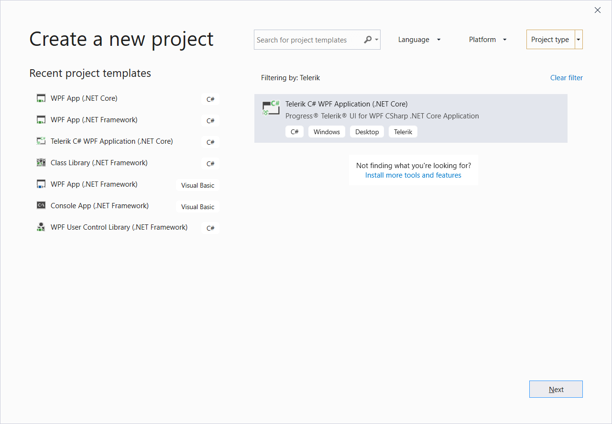
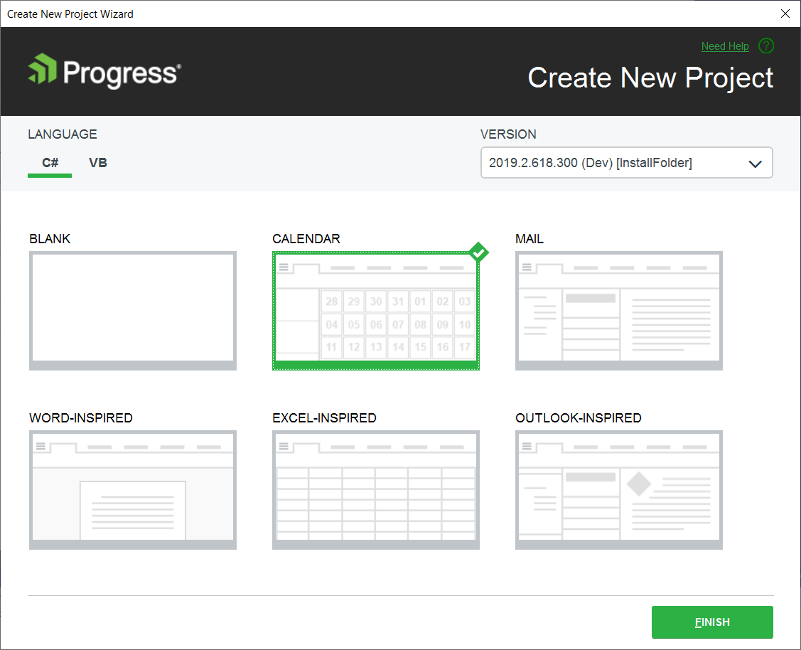
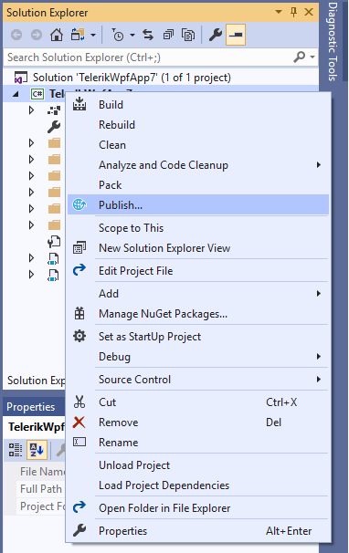
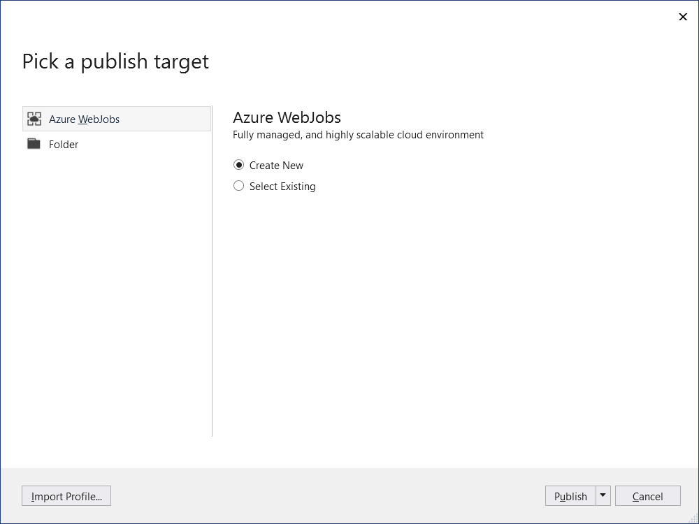
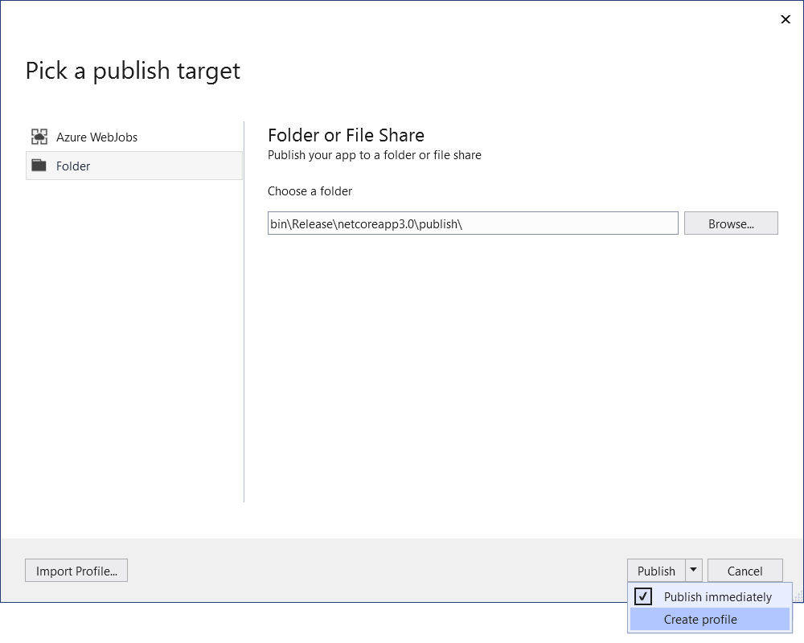
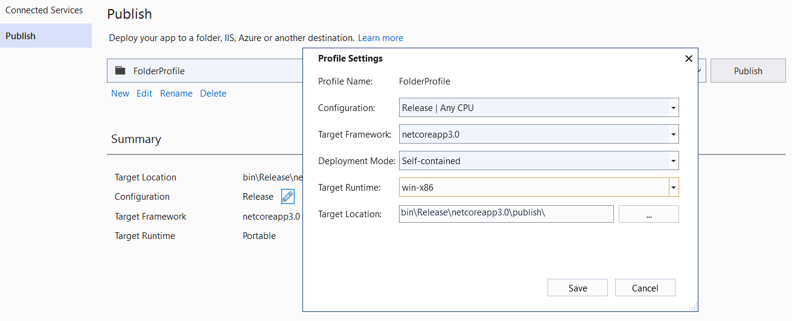
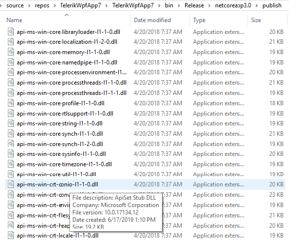

# Deploying WPF .NET Core Application

This article shows how to deploy a WPF .NET Core Application using Visual Studio.

>tip Read more about the deployment approaches, their benefits and differences, in the [3 Ways to Deploy a WinForms or WPF .NET Core Application](https://www.telerik.com/blogs/3-ways-to-deploy-a-winforms-or-wpf-net-core-application) blog post.

## Create an Application

>tip This step is described only for testing purposes. If you prefer, you can go directly to the [Deploy the Application](#deploy-the-application) section of this article.

1. Create a new WPF project using the [Telerik Visual Studio Extensions]() (VSX). If the VSX is installed you will see the __Telerik C# WPF Application (.NET Core)__ template in the Visual Studio's project templates list.

	
	
2. Select one of the application templates from the New Project Wizard. For this example, use the Calendar template.

	
	
#### __Figure 1: Calendar application created with the New Project Wizard__

## Deploy the Application

>important The approach shown here is available with Visual Studio 2019.

1. Right click the project in Visual Studio and select the __Publish__ option. This will open the __Pick a publish taget__ dialog.

	

2. Choose a publish location. For this example, click on the __Folder__ option and choose a directory where the application should be deployed. Then click __Create profile__.

	
	
	

3. Open the __Profile Settings__ via the __Configuration__ options and set the __Deployment Mode__ to __Self-contained__. Then select a __Target Runtime__.

	

4. Save the configuration and click the __Publish__ button. This will generate files in the publish location.

	

5. Copy the output files from the publish location to your deployment environment.

>tip You can package your application using the MSIX format. Read more, in the [What is MSIX?](https://docs.microsoft.com/en-us/windows/msix/overview) MSDN article.

## See Also

* [Migrating to .NET Core]()
