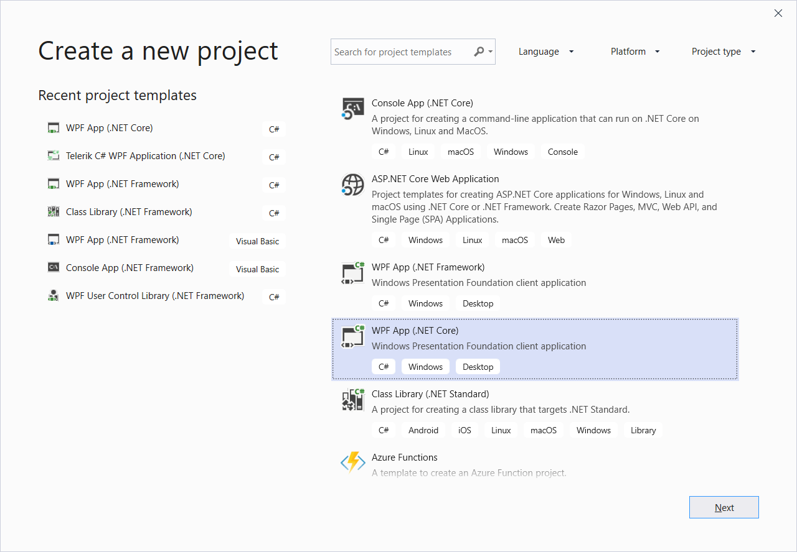
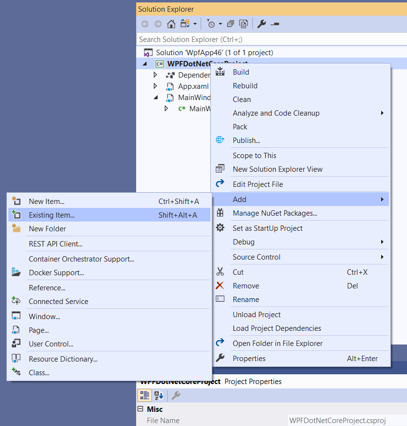
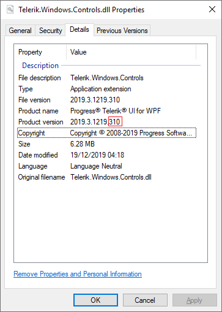

# Migrаting to .NET Core

This article shows how to migrate from an existing WPF .NET Framework project to a .NET Core one.

>tip Before proceeding with this topic you can check if your application's code is compatible with .NET Core using the [Microsoft Portability Analyzer](https://devblogs.microsoft.com/dotnet/are-your-windows-forms-and-wpf-applications-ready-for-net-core-3-0/) tool.

1. Create a new __.NET Core 3.0__ application using Visual Studio. 
	
	#### Figure 1: Creating new project
	

	> This VisualStudio template is available only with Visual Studio 2019. Otherwise, you will need to use the VS Command Prompt in order to create the project. This approach is shown in the [following blog post](https://www.telerik.com/blogs/how-to-update-wpf-winforms-app-to-dotnet-core-3).
	
	>tip You can also use the Telerik Visual Studio Extensions to create a new project. Read more about this in the [Integration]() section of the documentation.
	
2. Add the existing files from the original project as linked files to the .NET Core project.
	
	#### Figure 2: Linking files from the original project
	
	
	
 
3. Reference the Telerik assemblies built against .NET Core 3.0.
	
	If Telerik UI for WPF is installed on the machine, you can find the dlls in the "*UI for WPF installation folder\Binaries\NetCore*" folder. Otherwise, [download the .zip file]() with the dlls or install them via the [NuGet package manager]().
	
	#### Figure 3: Checking if a Telerik assembly is built against .NET Core 3.0
	

## Tips

* If your project has images with [__Build Action__](https://docs.microsoft.com/en-us/visualstudio/ide/build-actions?view=vs-2019) set to Resource, change it to Embeded Resource or Content.

* If you use the __AssemblyInfo__ or __App.manifest__ files from your original project, add them manually in the .NET Core project. The new project template uses a different approach and generates the same assembly attributes as part of the build process.
	
	#### __[XML] Example 1: GenerateAssemblyInfo attribute__
	{{region netcore-support-migration-0}}
		<generateassemblyinfo>false</generateassemblyinfo>
	{{endregion}}
	
* If you have referred to some references which are still not available in .NET Core as Windows.Composition, you can Include the [Windows.Compatibility Pack](https://docs.microsoft.com/en-us/dotnet/core/porting/windows-compat-pack) with the command below executed via the Command Prompt from Visual Studio.
	 
	
<pre>dotnet add package Microsoft.Windows.Compatibility</pre>

	
* The __RadRichTextBox__ control uses MEF to load additional UI components (like dialogs and document format providers dependencies). This implementation uses the Assembly.ReflectionOnlyLoadFrom method to inspect the assemblies for suitable parts. This method is not available in .NET Core. To work this around, provide a predefined type catalog at the startup of the application.
	
	#### __[C#] Example 3: Creating type catalog manually__
	{{region netcore-support-migration-2}}
		RadCompositionInitializer.Catalog = new TypeCatalog(
			// format providers
			typeof(XamlFormatProvider),
			typeof(RtfFormatProvider),
			typeof(DocxFormatProvider),
			typeof(PdfFormatProvider),
			typeof(HtmlFormatProvider),
			typeof(TxtFormatProvider),

			// mini toolbars
			typeof(SelectionMiniToolBar),
			typeof(ImageMiniToolBar),

			// context menu
			typeof(Telerik.Windows.Controls.RichTextBoxUI.ContextMenu),

			// the default English spell checking dictionary
			typeof(RadEn_USDictionary),

			// dialogs
			typeof(AddNewBibliographicSourceDialog),
			typeof(ChangeEditingPermissionsDialog),
			typeof(EditCustomDictionaryDialog),
			typeof(FindReplaceDialog),
			typeof(FloatingBlockPropertiesDialog),
			typeof(FontPropertiesDialog),
			typeof(ImageEditorDialog),
			typeof(InsertCaptionDialog),
			typeof(InsertCrossReferenceWindow),
			typeof(InsertDateTimeDialog),
			typeof(InsertTableDialog),
			typeof(InsertTableOfContentsDialog),
			typeof(ManageBibliographicSourcesDialog),
			typeof(ManageBookmarksDialog),
			typeof(ManageStylesDialog),
			typeof(NotesDialog),
			typeof(ProtectDocumentDialog),
			typeof(RadInsertHyperlinkDialog),
			typeof(RadInsertSymbolDialog),
			typeof(RadParagraphPropertiesDialog),
			typeof(SetNumberingValueDialog),
			typeof(SpellCheckingDialog),
			typeof(StyleFormattingPropertiesDialog),
			typeof(TableBordersDialog),
			typeof(TablePropertiesDialog),
			typeof(TabStopsPropertiesDialog),
			typeof(UnprotectDocumentDialog),
			typeof(WatermarkSettingsDialog));
	{{endregion}}
	
## See Also

* [Deploy WPF .NET Core Application]()

	

