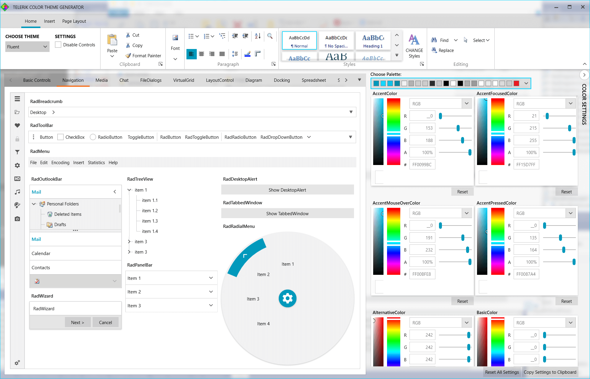

# Color Theme Generator

The [themes]() which support ThemePalette are fully customizable using the available brushes to adjust each color. 

For seamless color customization and faster palette creation that looks great and matches all controls, we created the **Color Theme Generator**.
     
## What is the Color Theme Generator?

The **Color Theme Generator** enables you to tweak theme colors and immediately see the results. The tool contains a few predefined palettes for each of the themes, making it easier to choose the right colors for your application.

It only takes a few simple steps to use the tool.

1. Choose a theme from the **CHOOSE THEME** drop down menu.

2. Change the color settings of brushes from the **COLOR SETTINGS** menu on the right.

3. Immediately see the effect on the left.

4. Go through all available controls from the tab on the right to see how each control looks.

5. When satisfied with the results, click the **Copy Settings to Clipboard** button to copy the code of the generated palette settings to the clipboard.

6. Paste the palette settings code in your application. The recommended place for this code is in the App class. Or anywhere before the InitializeComponent call of the main window or user control.

	#### __[C#] Example 1: Adding the copied settings in the application__
	{{region common-styling-color-theme-generator-0}}
		public MainWindow()
		{
			FluentPalette.Palette.AccentColor = (Color)ColorConverter.ConvertFromString("#FF0099BC");
			FluentPalette.Palette.AccentFocusedColor = (Color)ColorConverter.ConvertFromString("#FF15D7FF");
			FluentPalette.Palette.AccentMouseOverColor = (Color)ColorConverter.ConvertFromString("#FF00BFE8");
			FluentPalette.Palette.AccentPressedColor = (Color)ColorConverter.ConvertFromString("#FF0087A4");
			FluentPalette.Palette.AlternativeColor = (Color)ColorConverter.ConvertFromString("#FFF2F2F2");
			FluentPalette.Palette.BasicColor = (Color)ColorConverter.ConvertFromString("#33000000");
			FluentPalette.Palette.BasicSolidColor = (Color)ColorConverter.ConvertFromString("#FFCDCDCD");
			FluentPalette.Palette.ComplementaryColor = (Color)ColorConverter.ConvertFromString("#FFCCCCCC");
			FluentPalette.Palette.IconColor = (Color)ColorConverter.ConvertFromString("#CC000000");
			FluentPalette.Palette.MainColor = (Color)ColorConverter.ConvertFromString("#1A000000");
			FluentPalette.Palette.MarkerColor = (Color)ColorConverter.ConvertFromString("#FF000000");
			FluentPalette.Palette.MarkerInvertedColor = (Color)ColorConverter.ConvertFromString("#FFFFFFFF");
			FluentPalette.Palette.MarkerMouseOverColor = (Color)ColorConverter.ConvertFromString("#FF000000");
			FluentPalette.Palette.MouseOverColor = (Color)ColorConverter.ConvertFromString("#33000000");
			FluentPalette.Palette.PressedColor = (Color)ColorConverter.ConvertFromString("#4C000000");
			FluentPalette.Palette.PrimaryBackgroundColor = (Color)ColorConverter.ConvertFromString("#FFFFFFFF");
			FluentPalette.Palette.PrimaryColor = (Color)ColorConverter.ConvertFromString("#66FFFFFF");
			FluentPalette.Palette.PrimaryMouseOverColor = (Color)ColorConverter.ConvertFromString("#FFFFFFFF");
			FluentPalette.Palette.ReadOnlyBackgroundColor = (Color)ColorConverter.ConvertFromString("#00FFFFFF");
			FluentPalette.Palette.ReadOnlyBorderColor = (Color)ColorConverter.ConvertFromString("#FFCDCDCD");
			FluentPalette.Palette.ValidationColor = (Color)ColorConverter.ConvertFromString("#FFE81123");
			FluentPalette.Palette.DisabledOpacity = 0.3;
			FluentPalette.Palette.InputOpacity = 0.6;
			FluentPalette.Palette.ReadOnlyOpacity = 0.5;
	
			InitializeComponent();
		}
	{{endregion}}

To reset the default colors of the application, click the **Reset All Settings** button.

>important Download the **Color Theme Generator** application from the following page [Silverlight Color Theme Generator](https://demos.telerik.com/silverlight/Themesgenerator)[WPF Color Theme Generator](https://demos.telerik.com/wpf/colorthemegenerator)

>tip The source code of the Color Theme Generator application can be found in the [downloads section]() of your **Telerik** account.

## See Also
* [Setting a Theme]()
* [Xaml vs. NoXaml]()
* [Themes Suite]()

