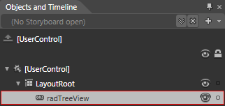
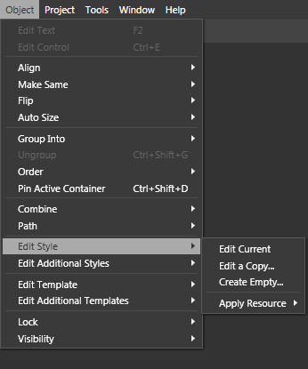
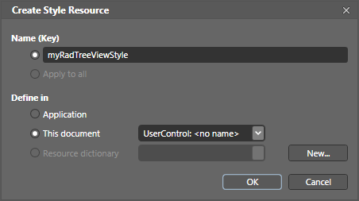
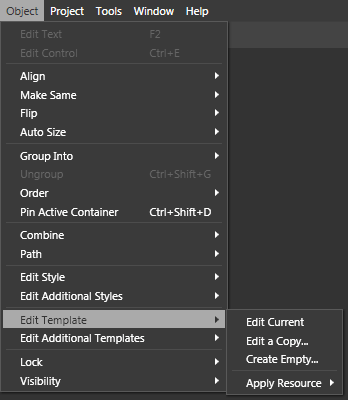

# Editing Control Templates in Expression Blend

This topic contains the following sections:

* [Edit Control Style in Expression Blend](#editing-control-templates-in-expression-blend)

* [Edit Control Template in Expression Blend](#edit-control-style-in-expression-blend)

## Edit Control Style in Expression Blend

The purpose of this section is to show you how to edit a __Style__ in __Expression Blend__. 

In order to edit a control style in Expression Blend you need to perform the following instructions:

* Open your application in Expression Blend.

>You can open your application in Expression Blend directly from your Visual Studio. For that purpose do the following things:

1. Open your Solution Explorer (View->Solution Explorer or use the Ctrl+Alt+L shortcut).

1. Select your user controls.

1. Right mouse button click and select "__Open in Expression Blend...__".

* In the "__Objects and Timeline__" pane (Window->Objects and Timeline) select the __Telerik control__ for which you want to create (modify) a style.

* Expand the __Object -> Edit Style__ menu.

* You have three options here:

* __Edit Current__ - if you choose it, this will open the currently applied style for edit.

>If you don't have an applied style to the control, this option will be disabled.

* __Edit a Copy...__ - edit a copy of the __default__ style. When you select this option a new dialog will be opened.
 

The "Create Style Resource" dialog will prompt you to select a name for your style, as well as to choose the location where your style will be defined in.

* __Create Empty...__- create an empty style for the selected control. When you select this option, the same "Create Style Resource" dialog will be opened. You should select a name for the style, as well as to choose the location where your style will be defined in.

## Edit Control Template in Expression Blend

The purpose of this section is to show you how to __edit/create a Template__ for the Telerik SilverlightWPF controls.

In order to edit a template in Expression Blend you need to perform the following instructions:

* Open your application in Expression Blend.

>You can open your application in Expression Blend directly from your Visual Studio. For that purpose do the following things:

1. Open your Solution Explorer (View->Solution Explorer or use the Ctrl+Alt+L shortcut).

1. Select your user controls.

1. Right mouse button click and select "__Open in Expression Blend...__".

* In the "__Objects and Timeline__" pane (Window->Objects and Timeline) select the __RadControl__ for which you want to create (modify) a template.

* Expand the __Object -> Edit Template__ menu.

* You have three options here:

* __Edit Current__ - if you choose it, this will open the currently applied template for edit.

>If you don't have an applied template to the control, this option will be disabled.

* __Edit a Copy...__ - edit a copy of the __default__ template. When you select this option a new dialog will be opened.

The "Create Style Resource" dialog will prompt you to select a name for your template, as well as to choose the location where your style will be defined in.

>Note that __Edit a Copy...__ will not declare you a copy of the default template as a resource in your XAML. Instead, it will create a copy of the default style with a ControlTemplate setter.

* __Create Empty...__ - create an empty template for the selected control. When you select this option, the same "Create Style Resource" dialog will be opened. You should select a name for the template, as well as to choose the location where your template will be defined in.

>In contrast to the __"Edit a Copy..."__ option, the __"Create Empty..."__ will create a new ControlTemplate as a resource in your XAML.

>It is not recommended to choose the __"Create Empty..."__ option, unless you are familiar with __TemplatedParts__ for the specific control.
