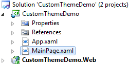
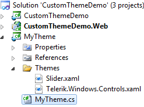

# Creating a Custom Theme Project - Using the Telerik Approach

## 

The approach described in the [Creating a Custom Theme Project]() topic is simple, but not optimal, especially when you create a theme for all Telerik controls. There are two significant performance problems:

* In Silverlight you cannot share __ResourceDictionaries__, hence for an application theme the XAML file will be parsed for every Telerik assembly, that is used in the application. 

* Searching in a huge dictionary is slow, so the themed controls in the application will load much faster if their styles are placed in small files.

To avoid the performance problems above, you can use the advanced mechanism for applying themes. The following topic demonstrates how to do that. Basically, you should create a new theme project but following the Telerik approach. You will have Telerik.Windows.Controls.xaml file that will merge only styles for controls declared in Telerik.Windows.Controls.dll assembly; Telerik.Windows.Controls.Input.xaml file merging only styles for controls declared in Telerik.Windows.Controls.Input.dll assembly; etc. Then you create a new class, which derives from __Telerik.Windows.Controls.Theme__. You should mark the Theme class with the __ThemeLocation__ attribute. 

#### __C#__

{{region common-styling-apperance-themes-custom-theme-project-telerik-approach_0}}
    [Telerik.Windows.Controls.ThemeLocation(Telerik.Windows.Controls.ThemeLocation.BuiltIn)]
	{{endregion}}

In the constructor you should set the source to point to a non-existent Generic.xaml file. When the Telerik __StyleManager__ uses a __Theme__ class with __ThemeLocation=BuiltIn__, it ignores the path to the XAML file and replaces it with "__/component/themes/[control assembly].xaml__". This will greatly reduce the amount of parsed/searched XAML when the theme is applied to many controls; hence this will also greatly improve the performance of complex controls (__GridView__, __Charting__, etc.) and applications.

The following tutorial demonstrates how to do that:

1. Open Visual Studio and create a new Silverlight Application. Name the project __CustomThemeDemo__.

	

1. Add a new Silverlight class library project to your solution, named __MyTheme__. 

1. In the __MyTheme__ project add references to the Telerik assemblies containing the controls you want to style. For example, if you have Style for __RadMenu__, you should have a reference to the __Telerik.Windows.Controls.Navigation.dll__ assembly. In this demo for simplicity the __RadSlider__ control will be styled. That's why you need to add a reference only to the __Telerik.Windows.Controls.dll__ assembly. 

1. In the __MyTheme__ project, add a new folder named __Themes__. All XAML files, describing the styles for the target controls, should be placed in the Themes folder. In the following example, the original Vista theme for the RadSlider control is copied from the UI for Silverlight installation folder (~*UI for Silverlight Installation Folder\Themes\Vista\Themes\Vista\Slider.xaml*) and pasted in the Themes folder of the MyTheme project. 

1. Add a new __ResourceDictionary__ to the __Themes__ folder. Name it __Telerik.Windows.Controls.xaml__. Use __Telerik.Windows.Controls.xaml__ as a __Resource Dictionary__ which contains __Merged Resource Dictionaries__ only for the controls from the Telerik.Windows.Controls.dll assembly.
	
	#### __XAML__
	
	{{region common-styling-apperance-themes-custom-theme-project-telerik-approach_1}}
		<ResourceDictionary
		    xmlns="http://schemas.microsoft.com/winfx/2006/xaml/presentation" 
		    xmlns:x="http://schemas.microsoft.com/winfx/2006/xaml">
		    <ResourceDictionary.MergedDictionaries>
		        <ResourceDictionary Source="/MyTheme;component/Themes/Slider.xaml" />
		    </ResourceDictionary.MergedDictionaries>
		</ResourceDictionary>
		{{endregion}}

1. Just for the demonstration, open the Slider.xaml file and modify the __SliderBackgroundTrack__ brush to __Red__.

	#### __XAML__
	
	{{region common-styling-apperance-themes-custom-theme-project-telerik-approach_2}}
		<SolidColorBrush x:Key="SliderBackgroundTrack" Color="Red" />
	{{endregion}}

1. Add a new class named __MyTheme__ in the __MyTheme__ project. The class should derive from the __Telerik.Windows.Controls.Theme__ base class. In the constructor you should set the source to point to a non-existent Generic.xaml file. Mark the class with the __ThemeLocation__ attribute.

	#### __C#__
	
	{{region common-styling-apperance-themes-custom-theme-project-telerik-approach_3}}
		using System;
		using Telerik.Windows.Controls;
		namespace Silverlight.Help.RadCommon
		{
		    [ThemeLocation( ThemeLocation.BuiltIn )]
		    public class MyTheme : Theme
		    {
		        public MyTheme()
		        {
		            this.Source = new Uri( "/MyTheme;component/themes/Generic.xaml", UriKind.RelativeOrAbsolute );
		        }
		    }
		}
	{{endregion}}

	
	#### __VB.NET__
	
	{{region common-styling-apperance-themes-custom-theme-project-telerik-approach_4}}
		Imports System
		Imports Telerik.Windows.Controls
		Namespace Silverlight.Help.RadCommon
		 <ThemeLocation(ThemeLocation.BuiltIn)> _
		 Public Class MyTheme
		  Inherits Theme
		  Public Sub New()
		   Me.Source = New Uri("/MyTheme;component/themes/Generic.xaml", UriKind.RelativeOrAbsolute)
		  End Sub
		 End Class
		End Namespace
	{{endregion}}

1. Finally, the __MyTheme__ project should have the following structure.

	
	
	>Again note that the Generic.xaml does not exist in the project. However, when the Telerik __StyleManager__ uses a __Theme__ class with __ThemeLocation=BuiltIn__, it ignores the path to the XAML file and replaces it with ";__component/themes/[control assembly].xaml__". In this example, the Telerik StyleManager will replace the provided path with "__/MyTheme;component/Themes/Telerik.Windows.Controls.xaml"__.

1. The next step is to apply the custom theme. In the Silverlight client project, add a reference to the project containing your custom theme (in this case this is the __MyTheme__ project).

	>You should have references to all assemblies that you are styling. Which means that if you have Style for __RadMenu__ in your theme project, you should have a reference to the __Telerik.Windows.Controls.Navigation.dll__ assembly in your application or you will get an exception.

1. Open the App.xaml.cs file and add the following code in the constructor. This will be enough to apply the theme globally to all Telerik controls.

	#### __C#__
	
	{{region common-styling-apperance-themes-custom-theme-project-telerik-approach_5}}
		Telerik.Windows.Controls.StyleManager.ApplicationTheme = new MyTheme.MyTheme();
		{{endregion}}
	
	
	
	#### __VB.NET__
	
	{{region common-styling-apperance-themes-custom-theme-project-telerik-approach_6}}
		Telerik.Windows.Controls.StyleManager.ApplicationTheme = New MyTheme.MyTheme()
		{{endregion}}

1. If you want to apply the theme only for a specific control, then you should stick to the following approach:

	
	#### __XAML__
	
	{{region common-styling-apperance-themes-custom-theme-project-telerik-approach_7}}
		<UserControl.Resources>
		    <myThemeProject:MyTheme x:Name="MyTheme" />
		</UserControl.Resources>
		<Grid x:Name="LayoutRoot"
		        Background="White" Margin="50">
		    <telerik:RadSlider x:Name="radSlider"/>
		</Grid>
		{{endregion}}
	
	

## See Also

 * [Creating a Custom Theme Project]()

 * [Modifying a Built-In Theme]()
