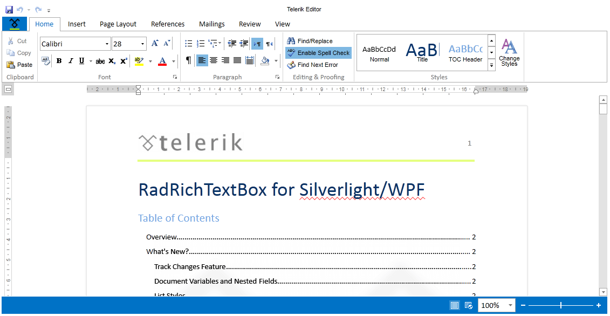
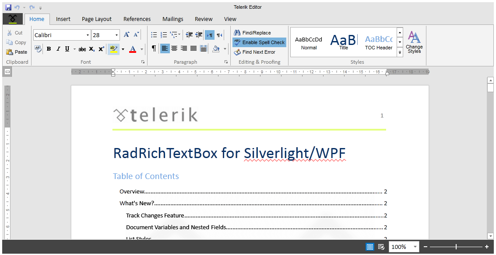
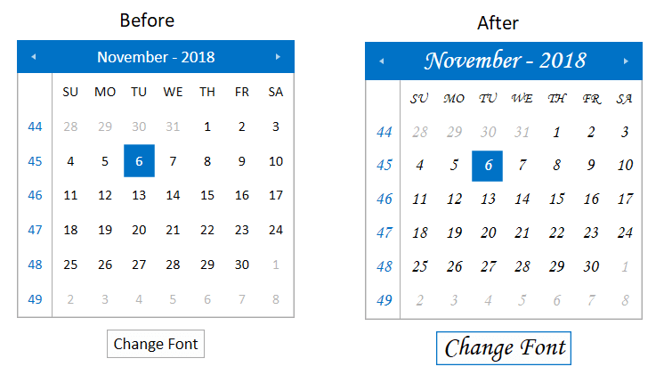

# Office2013 Theme

The `Office2013` theme delivers a flat modern UI and three built-in color variations – `White`, `Light Gray`, `Dark Gray`.

Jump to the following topics to learn about the specifics of the theme's palette and features.

* [Default Theme Colors](#default-theme-colors)
* [Changing Palette Colors](#changing-palette-colors)
* [Changing Theme Variation](#changing-theme-variation)
* [Changing Font Properties](#changing-font-properties)
* [Changing Opacity](#changing-opacity)

## Default Theme Colors

|Color name|White| |Light Gray| |Dark Gray| |
|----------|-----|---|----------|---|---------|---|
|AccentMainColor|FF0072C6|

|FF0072C6|

|FF0072C6|

|
|AccentColor|FF0072C6|

|FF0072C6|

|FF444444|

|
|MainColor|FFFFFFFF|

|FFFFFFFF|

|FFFFFFFF|

|
|InvertedColor|FF000000|

|FF000000|

|FF000000|

|
|BasicColor|FFFDFDFD|

|FFFDFDFD|

|FFFDFDFD|

|
|StrongColor|FF767676|

|FF767676|

|FF767676|

|
|ValidationColor|FFFF0000|

|FFFF0000|

|FFFF0000|

|
|LowLightMainColor|FFF1F1F1|

|FFF1F1F1|

|FFF1F1F1|

|
|LowLightColor|FFFFFFFF|

|FFF1F1F1|

|FFE5E5E5|

|
|LowDarkColor|FFFFFFFF|

|FFFAFAFA|

|FFF3F3F3|

|
|MediumLightColor|FFE1E1E1|

|FFE1E1E1|

|FFE1E1E1|

|
|MediumDarkColor|FFC6C6C6|

|FFC6C6C6|

|FFC6C6C6|

|
|HighLightColor|FFD4D4D4|

|FFC6C6C6|

|FFABABAB|

|
|HighDarkColor|FFABABAB|

|FFABABAB|

|FFABABAB|

|
|EffectLowColor|33FFFFFF|

|33FFFFFF|

|FF0072C6|

|
|EffectHighColor|33000000|

|33000000|

|800072C6|

|
|EffectAccentLowColor|330072C6|

|330072C6|

|330072C6|

|
|EffectAccentHighColor|800072C6|

|800072C6|

|800072C6|

|

## Changing Palette Colors

Office2013 provides dynamic change of the palette colors responsible for the brushes used in our controls. Their defaults are stated above. This mechanism is used to modify the color variation of the theme. 

The general naming convention is: `Office2013Palette.Palette.[name]Color` is responsible for `[name]Brush` – e.g. `Office2013Palette.Palette.AccentColor` sets the color for `telerik:Offie2013Resource ResourceKey=AccentBrush`

Changing the colors can be achieved in code behind.

#### __[XAML] Setting palette colors__
{{region xaml-styling-appearance-office2013-theme-0}}
	Office2013Palette.Palette.AccentColor = Color.FromRgb(255, 0, 0);
{{endregion}}

## Changing Theme Variation

The following are the supported color variations of the Office2013 theme:

* `White`&mdash;White color theme palette. This is also the default variation of the theme.

* `LightGray`&mdash;Light gray theme palette.

* `DarkGray`&mdash;Dark gray theme palette.

This is how the `ColorVariation` enumeration looks:

#### __[C#]__
{{region cs-styling-appearance-office2013-theme-0}}
	/// 

	/// Represents theme color variations.
	/// 

	public enum ColorVariation
	{
		/// 

		/// Represents Dark Gray Office2013 theme palette.
		/// 

		DarkGray,

		/// 

		/// Represents Light Gray Office2013 theme palette.
		/// 

		LightGray,

		/// 

		/// Represents the default White Office2013 theme palette.
		/// 

		White
	}
{{endregion}}

The `Office2013` theme offers a very intuitive and easy way to change its color variation. You can change the variation by using the `LoadPreset` method of `Office2013Palette` in the entry point of your application. You just have to pass to the method the desired color variation as a parameter.

For example, if you want to set the `DarkGray` color variation, you should have the following code-block in your application:


#### __[C#]__
{{region cs-styling-appearance-office2013-theme-1}}
    public MainWindow()
    {
        Office2013Palette.LoadPreset(Office2013Palette.ColorVariation.DarkGray);

        InitializeComponent();
    }
{{endregion}}




#### __[C#]__

{{region cs-styling-appearance-office2013-theme-2}}
    public UserControl()
    {
        Office2013Palette.LoadPreset(Office2013Palette.ColorVariation.DarkGray);

        InitializeComponent();
    }
{{endregion}}


>The `DarkGray` variation of the theme is designed with a dark background in mind and it is recommended to use such a background in your application when choosing it.

## Changing Font Properties

When using the `Office2013` theme you can dynamically change the `FontSize` and `FontFamily` properties of all components in the application the same way as you do in all other [Available Themes]() which support ThemePalette.

These properties are public so you can easily modify the theme resources at one single point. The most commonly used FontSize in the theme is named `FontSizeL` and its default value is __15__. The bigger font sizes are used for headers and footers while smaller ones are used inside complex controls such as `RadRibbonView`, `RadGauge`, `RadGanttView`, etc. As for the FontFamily - there is only one FontFamily resource which is named FontFamily and it is set to `Calibri`.

>Please note that for complex scenarios we strongly recommend setting font size only initially before the application is initialized. We recommend font sizes between 11px and 19px for the __FontSize__ property.

All the available __FontSizes__ and __FontFamily__ as well as their __default values__:

#### __[C#]__
{{region cs-styling-appearance-office2013-theme-3}}
	Office2013Palette.Palette.FontSizeXXS = 10;
	Office2013Palette.Palette.FontSizeXS = 12; 
	Office2013Palette.Palette.FontSizeS = 13;
	Office2013Palette.Palette.FontSize = 14;
	Office2013Palette.Palette.FontSizeL = 15;
	Office2013Palette.Palette.FontSizeXL = 16;
	Office2013Palette.Palette.FontFamily = new FontFamily("Calibri");
{{endregion}}

More details regarding the usage of the rarely used font sizes inside the different controls can be found below:

* `Office2013Palette.Palette.FontSizeXXS` is used:
	* GridViewNewRow in Telerik.Windows.Controls.GridView
	
* `Office2013Palette.Palette.FontSizeXL` is used:
	* ExpressionEditor in Telerik.Windows.Controls.Expressions
	* WizzardPage in Telerik.Windows.Controls.Navigation 
	* ScheduleView's MonthView items in Telerik.Windows.Controls.ScheduleView
	
As the following example shows, you can change the default FontFamily from "Calibri" to "MonoType Corsiva" and the FontSize from __15__ to __16__ on a click of a button:

#### __[XAML]__
{{region xaml-styling-appearance-office2013-theme-0}}
	<StackPanel>
		<telerik:RadCalendar x:Name="Calendar" Width="250" Height="250" Margin="4 10"/>
		<telerik:RadButton HorizontalAlignment="Center" Content="Change Font" Click="OnButtonChangeFontSizeClick" />
	</StackPanel>
{{endregion}}

#### __[C#]__
{{region cs-styling-appearance-office2013-theme-4}}
	private void OnButtonChangeFontSizeClick(object sender, RoutedEventArgs e)
	{
		Office2013Palette.Palette.FontSizeL = 24;
		Office2013Palette.Palette.FontSizeS = 16;
		Office2013Palette.Palette.FontFamily = new FontFamily("MonoType Corsiva");
	}
{{endregion}}

This will be the final result:

## Changing Opacity 

If you need to change the opacity of the disabled elements, you can now easily do so by using the `DisabledOpacity` property of the `Office2013Palette`. Its default value is __0.3__.

#### __[C#] Changing the opacity__
{{region cs-styling-appearance-office2013-theme-5}}
	Office2013Palette.Palette.DisabledOpacity = 0.5;
{{endregion}}
	
#### __[VB.NET] Changing the opacity__
{{region vb-styling-appearance-office2013-theme-0}}
	Office2013Palette.Palette.DisabledOpacity = 0.5
{{endregion}}

## Merging Modified Palette Resources With StyleManager Theming Approach

When modifying fonts, colors, or other resources from the `Office2013Palette` and `StyleManager` is used as theming mechanism, the theme's `ResourceDictionary` needs to be merged in __App.xaml__ file to apply the changes.

#### __[XAML] Merging the theme's ResourceDictionary in App.xaml__
{{region xaml-styling-appearance-office2013-theme-1}}
	<Application.Resources> 
	    <ResourceDictionary> 
	        <ResourceDictionary.MergedDictionaries> 
	            <telerik:Office2013ResourceDictionary/> 
	        </ResourceDictionary.MergedDictionaries> 
	    </ResourceDictionary> 
	</Application.Resources>
{{endregion}}

## See Also
 * [Setting a Theme (Using  Implicit Styles)]()
