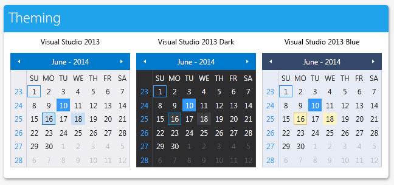
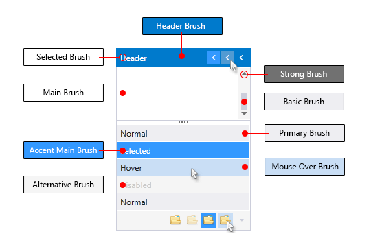
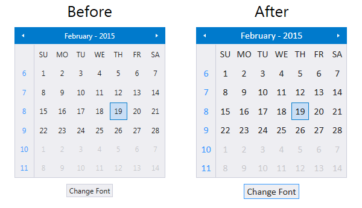

# VisualStudio2013 Theme

The official Q2 2014 release of UI for {{ site.framework_name }} brought a brand new theme inspired by the Visual Studio design with three color variations – `Light`, `Dark` and `Blue`.        

The following topic explains the specifics of the theme's color variations.      

## Theme Color Variations

There are three palettes of colors which can be easily set by choosing one of the three default color variations:

The next screenshot display RadCalendar in the three color variations:

## Theme Variation Changing

You can switch the three color palettes by calling the `LoadPreset` method as shown below:        

#### __[C#]__

{{region common-styling-appearance-visualstudio2013-theme_0}}	
	//default color variation
	VisualStudio2013Palette.LoadPreset(VisualStudio2013Palette.ColorVariation.Light);
	
	//blue color variation
	VisualStudio2013Palette.LoadPreset(VisualStudio2013Palette.ColorVariation.Blue);
	
	//dark color variation
	VisualStudio2013Palette.LoadPreset(VisualStudio2013Palette.ColorVariation.Dark); 
{{endregion}}

>important The `Dark` variation of the theme is designed with a dark background in mind. It is recommended to use such a background in your application when choosing it.

## VisualStudio2013 Palette brushes and colors

Below you can find the differences between the three color variations. Every brush has relevant HEX value in the corresponding color variation.

|Brush name|Light (default)| |Dark| |Blue| |
|----------|---------------|---|----|---|----|---|
|__Brushes, which are same in the three palettes__| | | | | | |
|AccentMainBrush|FF3399FF|

|FF3399FF|

|FF3399FF|

|
|AccentDarkBrush|FF007ACC|

|FF007ACC|

|FF007ACC|

|
|SelectedBrush|FFFFFFFF|

|FFFFFFFF|

|FFFFFFFF|

|
|ValidationBrush|FFF3333|

|FFFF3333|

|FFFF3333|

|
|__Brushes, which are different in the three palettes__| | | | | | |
|AccentBrush|FF007ACC|

|FF007ACC|

|FFE5C365|

|
|MarkerBrush|FF1E1E1E|

|FFF1F1F1|

|FF1E1E1E|

|
|StrongBrush|FF717171|

|FF999999|

|FF717171|

|
|MainBrush|FFFFFFFF|

|FF1E1E1E|

|FFFFFFFF|

|
|PrimaryBrush|FFEEEEF2|

|FF2D2D30|

|FFE6EBF5|

|
|AlternativeBrush|FFF5F5F5|

|FF252526|

|FFF6F6F6|

|
|MouseOverBrush|FFC9DEF5|

|FF3E3E40|

|FFFDF4BF|

|
|BasicBrush|FFCCCEDB|

|FF3F3F46|

|FFCCCEDB|

|
|SemiBasicBrush|66CCCEDB|

|663F3F46|

|66CCCEDB|

|
|HeaderBrush|FF007ACC|

|FF007ACC|

|FF35496A|

|
|ComplementaryBrush|FFDBDDE6|

|FF434346|

|FFDBDDE6|

|
|ReadOnlyBackgroundBrush|FFF5F5F5|

|FF252526|

|FFF6F6F6|

|
|ReadOnlyBorderBrush|FFCCCEDB|

|FF3F3F46|

|FFCCCEDB|

|
|Additional color| | | | | | |		
|DefaultForegroundColor|FF1E1E1E|

|FFF1F1F1|

|FF1E1E1E|

|

\* `DefaultForegroundColor` is the only resource of type Color and not a SolidColorBrush in VisualStudio2013 palette. Currently it is used only in the ExpressionEditor.

## Theme Palette brushes description

Here you can find more details about each brush and where it is usually applied.

The first four colors have the same value in the three color variations and they are commonly used among all controls:  
* `AccentMainBrush`&mdash;Blue by default and it is the main accent brush for the theme
* `AccentDarkBrush`&mdash;Blue by default and it is the darker accent brush for the theme
* `SelectedBrush`&mdash;White by default and is the main color for text or paths which are over elements with accent background
* `ValidatonBrush`&mdash;Red by default and it is the brush used for validation where such is applicable in our controls

The colors that have different HEX value can be ordered by purpose.

First we needed another accent brush which has the same value as AccentDarkBrush for the Light and Dark color variations of VisualStudio2013 theme, but orange in the Blue color variation. This was necessary due to our aim to be as much closer as possible to the Visual Studio's product design.  
* `AccentBrush`&mdash;another accent brush, usually used for border of elements in their MouseOver, Active, Toggled or Focused state. 

There are two brushes usually used for foregrounds: 
* `MarkerBrush`&mdash;the main brush used for text color, also path's fill in MouseOver state
* `StrongBrush`&mdash;paths' and ticks' fill in Normal state, also ReadOnly text

There are six brushes usually used for background and border color:  
* `MainBrush`&mdash;brush used for background of controls with direct input such as TextBox, MaskedInput, Editable ComboBox, AutoCompleteBox, PasswordBox. Also used as main background of elements that has different content with unpredictable background (PrimaryBrush or AlternativeBrush).
* `PrimaryBrush`&mdash;brush used for background of most of the controls that have no direct input in their normal state.
* `AlternativeBrush`&mdash;brush used as alternative background of PrimaryBrush. Also used as background of Popups and DropDowns.
* `MouseOverBrush`&mdash;brush used for background of elements that are in MouseOver state.
* `BasicBrush`&mdash;brush widely used for border color of controls in their Normal state.
* `SemiBasicBrush`&mdash;the same brush as BasicBrush with 40% opacity, used for background of elements that are in MouseOver state.

Some controls such as Window, RibbonView, ScheduleView, Docking Pane, Docking ToolWindow, TileView have headers with a specific brush for background:  
* `HeaderBrush`&mdash;brush used for background of headers

Additional brush is introduced rarely used for elements in Disabled state:
* `ComplementaryBrush`

The following screenshot shows the usage of some of the brushes:

## Changing Fonts

The official Q1 2015 release of Telerik UI for WPFSilverlight introduced features that allow you to dynamically change the `FontSize` and `FontFamily` properties of all components in the application for the VisualStudio2013 theme. 

All Telerik controls use resources that are linked to one major singleton object that contains the FontSize and FontFamily properties used for the VisualStudio2013 theme. These properties are public so you can easily modify the theme resources at one single point. The most commonly used FontSize in the theme is named FontSize and its default value is __12__. The bigger font sizes are used for headers and footers while smaller ones are used inside complex controls such as `RadRibbonView`, `RadGauge`, `RadGanttView`, etc. As for the FontFamily - there is only one FontFamily resource which is named FontFamily and it is set to `Segoe UI`.

>Please note that for complex scenarios we strongly recommend setting font size only initially before the application is initialized. We recommend font sizes between 11px and 19px for the FontSize property.

All the available `FontSizes` and `FontFamily` as well as their __default values__:

#### __[C#]__
{{region common-styling-appearance-visualstudio2013-theme_1}}
	VisualStudio2013Palette.Palette.FontSizeXXS = 9; 
	VisualStudio2013Palette.Palette.FontSizeXS = 10;
	VisualStudio2013Palette.Palette.FontSizeS = 11; 
	VisualStudio2013Palette.Palette.FontSize = 12;
	VisualStudio2013Palette.Palette.FontSizeL = 13;
	VisualStudio2013Palette.Palette.FontSizeXL = 20;
	VisualStudio2013Palette.Palette.FontSizeXXL = 22;
	VisualStudio2013Palette.Palette.FontFamily = new FontFamily("Segoe UI");
{{endregion}}

More details regarding the usage of the rarely used font sizes inside the different controls can be found below:

* `VisualStudio2013Palette.Palette.FontSizeXXS` is used only in:
	* HorizontalBulletGraphStyle and VerticalBullerGraphStyle in Telerik.Windows.Controls.DataVisualization
  
* `VisualStudio2013Palette.Palette.FontSizeXS` is used in: 
	* TimeBar's SelectionRangeStyle in Telerik.Windows.Controls.DataVisualization
	* ExpressionEditor in Telerik.Windows.Controls.Expressions
	* GridViewGroupPanel in Telerik.Windows.Controls.GridView
  
* `VisualStudio2013Palette.Palette.FontSizeS` is used in: 
	* TimeBar's ItemControlStyle in Telerik.Windows.Controls.DataVisualization
	* GanttView's EventContainerStyle in Telerik.Windows.Controls.GanntView
	* ScheduleView TimeRulerItems' styles in Telerik.Windows.Controls.ScheduleView 
  
* `VisualStudio2013Palette.Palette.FontSizeL` is used in: 		
	* TimeBar's GroupControlStyle in Telerik.Windows.Controls.DataVisualization		
	* Docking's Headers in Telerik.Windows.Controls.Docking 
	* ScheduleView TimeRulerGroupItems' styles in Telerik.Windows.Controls.ScheduleView 
	
* `VisualStudio2013Palette.Palette.FontSizeXXL` is used in: 
	* ScheduleView warnings
	
As the following example shows, you can change the default FontFamily from "Segoe UI" to "Calibri" and the FontSize from __12__ to __16__ on a click of a button:

#### __[XAML]__
{{region common-styling-appearance-visualstudio2013-theme_0}}
	<StackPanel>
		<StackPanel Orientation="Horizontal" HorizontalAlignment="Center">
			<telerik:RadCalendar x:Name="Calendar" Width="250" Height="250" Margin="4 10"/>
			<telerik:RadClock x:Name="Clock" Height="250" Margin="4 10" TimeInterval="0:0:1"/>
		</StackPanel>
		<telerik:RadButton x:Name="BtnChangeFontSize" VerticalAlignment="Center" 
						   HorizontalAlignment="Center" Content="Change Font"
						   Click="OnButtonChangeFontSizeClick" />
	</StackPanel>
</StackPanel>
{{endregion}}

#### __[C#]__
{{region common-styling-appearance-visualstudio2013-theme_2}}
	private void OnButtonChangeFontSizeClick(object sender, RoutedEventArgs e)
	{
	   VisualStudio2013Palette.Palette.FontSize = 16;
	   VisualStudio2013Palette.Palette.FontFamily = new FontFamily("Calibri");
	}
{{endregion}}

This will be the final result:

## ReadOnly Properties

In the __R2 2019__ version, the following properties were introduced in the `VisualStudio2013Palette` to control the look and feel of elements in their readonly state:

* `ReadOnlyBackgroundBrush`&mdash;Used as a background of elements that are in a read-only state.
* `ReadOnlyBorderBrush`&mdash;Used in borders inside elements that are in a read-only state.
* `ReadOnlyOpacity`&mdash;Used for text in inputs when they are in a read-only state.

## Changing DisbledOpacity

If you need to change the opacity of disabled elements, you can easily do it by using the `DisabledOpacity` property of the `VisualStudio2013Palette`. The default value of the property is __0.2__.

#### __[XAML] Changing the disabled opacity__
{{region common-styling-appearance-visualstudio2013-theme-3}}
	VisualStudio2013Palette.Palette.DisabledOpacity = 0.4;
{{endregion}}

__Setting the disabled opacity__

	

## Merging Modified Palette Resources With StyleManager Theming Approach

When modifying fonts, colors, or other resources from the `VisualStudio2013Palette` and `StyleManager` is used as theming mechanism, the theme's `ResourceDictionary` needs to be merged in __App.xaml__ file to apply the changes.

#### __[XAML] Merging the theme's ResourceDictionary in App.xaml__
{{region common-styling-appearance-visualstudio2013-theme-4}}
	<Application.Resources> 
	    <ResourceDictionary> 
	        <ResourceDictionary.MergedDictionaries> 
	            <telerik:VisualStudio2013ResourceDictionary/> 
	        </ResourceDictionary.MergedDictionaries> 
	    </ResourceDictionary> 
	</Application.Resources>
{{endregion}}

## See Also
 * [Setting a Theme (Using  Implicit Styles)]()
