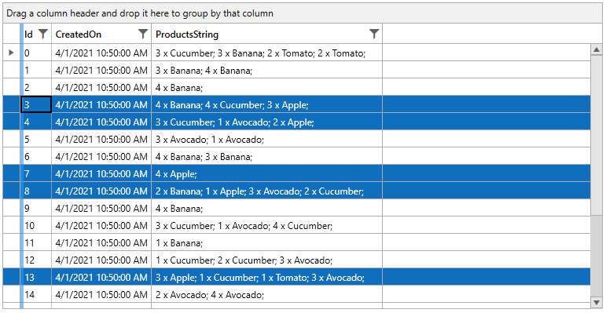
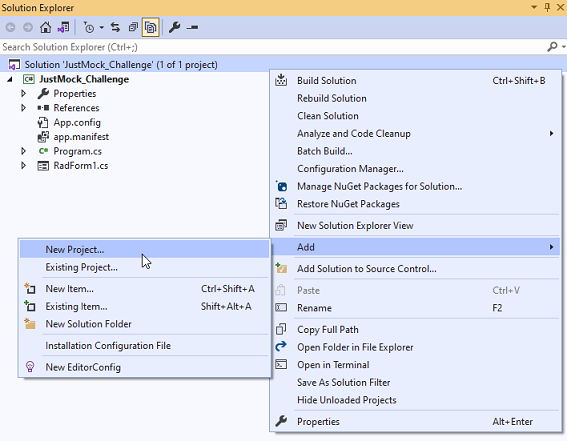
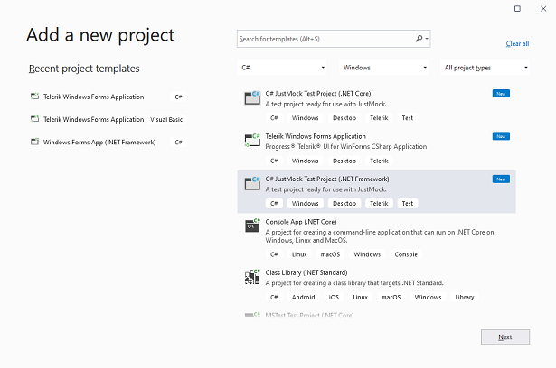
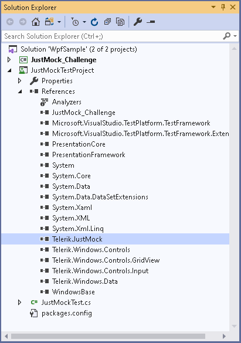

# Unit Testing Tutorial with JustMock  

Quite often, software depends on third-party libraries, e.g. the Telerik UI for WPF suite. Having a complete set of unit tests allows you to upgrade any third-party library without worrying that they will break due to a defect outside of your control. Updating third-party technology is particularly important when new features, significant improvements and bug fixes are released that will benefit your project. The more often you do it, the easier it will be to manage the updates.

In addition to this, if a unit test has to read a database each time it is run and expects a specific value to be present in the database, we directly depend on the database. What happens if another developer is expecting a different value in that database? What happens if another developer is running a test that changes that value? Suddenly, this test becomes unpredictable, passing one moment and then suddenly failing the next despite the fact that the code has not changed. A common requirement is not only to keep a test isolated to the code under test to help track down where the defect is, but to isolate it to keep the tests consistent so you are not directly dependent on the actual data.

Code that has to interact with an external resource like a database or a web service will run slower due to the latency in the communication with these external resources. The mocks of these external resources respond much faster than the actual external resources, meaning that the entire suite of unit test can run in seconds, not minutes.

This tutorial will walk you through the process of creating unit tests with [JustMock](https://www.telerik.com/products/mocking.aspx) for a project that uses the most commonly used control from the Telerik UI for WPF suite, a.k.a. **RadGridView**.

Let's start with details about the project's setup and what we have implemented.

#### Sample UserControl Setup

#### __[XAML] Example 1: Defining RadGridView in XAML__
{{region just-mock-tutorial-0}}
	<UserControl x:Class="JustMockExampleApp.GridViewUserControl"
				 xmlns="http://schemas.microsoft.com/winfx/2006/xaml/presentation"
				 xmlns:x="http://schemas.microsoft.com/winfx/2006/xaml"
				 xmlns:mc="http://schemas.openxmlformats.org/markup-compatibility/2006" 
				 xmlns:d="http://schemas.microsoft.com/expression/blend/2008" 
				 xmlns:telerik="http://schemas.telerik.com/2008/xaml/presentation"
				 mc:Ignorable="d" 
				 d:DesignHeight="450" d:DesignWidth="800">
		<Grid>
			<telerik:RadGridView x:Name="gridView"
								 SelectionMode="Multiple" 
								 ItemsSource="{Binding Orders}"
								 AutoGenerateColumns="False">
				<telerik:RadGridView.Columns>
					<telerik:GridViewDataColumn DataMemberBinding="{Binding Id}" />
					<telerik:GridViewDataColumn DataMemberBinding="{Binding CreatedOn}" />
					<telerik:GridViewDataColumn DataMemberBinding="{Binding ProductsString}" />
				</telerik:RadGridView.Columns>
			</telerik:RadGridView>
		</Grid>
	</UserControl>
{{endregion}}

#### __[C#] Example 2: Defining the rows model__
{{region just-mock-tutorial-1}}
	public class Order
	{
		public int Id { get; set; }
		public DateTime CreatedOn { get; set; }
		public List<Product> Products { get; set; }

		public string ProductsString
		{
			get
			{
				StringBuilder sb = new StringBuilder();
				foreach (Product p in Products)
				{
					sb.Append(p.Quantity + " x " + p.Name + "; ");
				}
				return sb.ToString();
			}
		}

		public Order(int id, DateTime createdOn, List<Product> products)
		{
			this.Id = id;
			this.CreatedOn = createdOn;
			this.Products = products;
		}

		private float GetTotalAmount()
		{
			float sum = 0;
			foreach (Product p in this.Products)
			{
				sum += (p.Price * p.Quantity);
			}
			return sum;
		}

		public bool ContainsProduct(string name)
		{
			foreach (Product p in this.Products)
			{
				if (p.Name == name)
				{
					return true;
				}
			}
			return false;
		}
	}

	public class Product
	{
		public string Name { get; set; }
		public float Price { get; set; }
		public int Quantity { get; set; }

		public Product(string name, float price, int quantity)
		{
			this.Name = name;
			this.Price = price;
			this.Quantity = quantity;
		}
	}
{{endregion}}

#### __[C#] Example 3: Defining code behind__
{{region just-mock-tutorial-2}}
	public partial class GridViewUserControl : UserControl
	{
		private static Random rnd = new Random(0);

		public RadGridView GridView
		{
			get { return gridView; }
		}

		public GridViewUserControl()
		{
			StyleManager.ApplicationTheme = new Office2019Theme();
			InitializeComponent();
			gridView.ItemsSource = GetData();
			SelectOrdersByProduct("Apple");
		}
		
		public void SelectOrdersByProduct(string productName)
		{
			this.gridView.SelectedItems.Clear();
			var orders = (ObservableCollection<Order>)this.gridView.ItemsSource;
			foreach (var order in orders)
			{
				if (order.ContainsProduct(productName))
				{
					this.gridView.SelectedItems.Add(order);
				}
			}
		}		

		public ObservableCollection<Order> GetData()
		{
			List<string> productNames = new List<string>() { "Apple", "Banana", "Avocado", "Cucumber", "Tomato", "Orange" };
			List<float> productPrices = new List<float>() { 1.45f, 3.15f, 2.30f, 2.80f, 1.20f, 4.30f };
			ObservableCollection<Order> orders = new ObservableCollection<Order>();

			int ordersCount = rnd.Next(5, 30);
			int productsCount = 0;
			int productIndex = -1;
			for (int i = 0; i < ordersCount; i++)
			{
				List<Product> orderProducts = new List<Product>();
				productsCount = rnd.Next(1, 5);
				for (int j = 0; j < productsCount; j++)
				{
					productIndex = rnd.Next(0, productsCount + 1);
					orderProducts.Add(new Product(productNames[productIndex], productPrices[productIndex], rnd.Next(1, 5)));
				}
				orders.Add(new Order(i, DateTime.Now, orderProducts));
			}
			return orders;
		}
	}  
{{endregion}}

If you run the project, you are expected to obtain the following result.

#### Figure 1: Sample WPF Project to Test

The above code includes the **Order** and **Product** classes' implementation and two public methods of the UserControl, **GetData** and **SelectOrdersByProduct**. The main purpose of the **GetData** method is to produce any random Orders data that will be used for RadGridView.**ItemsSource**. It is not important what is the actual implementation of the method itself and how the data is obtained. It can connect to a database, selects a query, fill a DataTable or read a file to populate a list. On the other hand, the **SelectOrdersByProduct** method accepts a string parameter representing a product name and selects all rows in the grid where the Order contains the specific product.

For the purpose of the unit testing, you don't want to bother about the data and consume time for preparing appropriate dummy data. You just need a grid filled with data and focus on the logic you have to test, e.g. check whether the correct rows will be selected after calling the **SelectOrdersByProduct** method. Here comes the benefit of [JustMock](https://www.telerik.com/products/mocking.aspx).

## JustMock Integration in your WPF Project

It is possible either to create a brand new JustMock Test Project or add a reference of Telerik.JustMock.Dll to an existing unit test project: [Add Telerik JustMock to Your Test Project](https://docs.telerik.com/devtools/justmock/getting-started/using-telerik-justmock-in-your-test-project)

#### Figure 2: Add a JustMock Test Project

#### Figure 3: Add a reference of Telerik.JustMock.Dll to the existing unit test project

Then, make sure that the profiler is enabled.

#### Figure 4: JustMock Profiler

[Arrange/Act/Assert](https://docs.telerik.com/devtools/justmock/basic-usage/arrange-act-assert) (AAA) is a pattern for arranging and formatting code in Unit Test methods. We will follow it in this tutorial as well.

## DataSource Collection Mocking

The **GetData** method returns random data representing Orders collection where each order contains one or multiple products. We want to test whether the **SelectOrdersByProduct** method will select the correct number of rows in **RadGridView** passing a product name, e.g. select all orders that contain "Apple" product. Since we don't know what data will be returned from the **GetData** method, we don't know how many orders will have apples. So we are dependent on the collection. This dependency can be eliminated by forcing the **GetData** method to return a predefined collection where you will know how many apples exactly we have. 

#### __[C#]__
{{region just-mock-tutorial-3}}
	[TestMethod]
	public void TestMethodSelectRows()
	{
		// Arrange
		ObservableCollection<Order> myCollection = new ObservableCollection<Order>();
		myCollection.Add(new Order(1, DateTime.Now, new List<Product>()
		{
			new Product("Apple",1.45f ,3),
			new Product("Banana",3.15f ,2),
			new Product("Avocado",2.30f ,1),
			new Product("Cucumber",2.80f ,2)
		}));

		myCollection.Add(new Order(2, DateTime.Now, new List<Product>()
		{
			new Product( "Tomato",1.20f ,4),
			new Product( "Cucumber",2.80f ,2),
			new Product( "Orange",4.30f ,3)
		}));

		myCollection.Add(new Order(3, DateTime.Now, new List<Product>()
		{
			new Product( "Apple",1.45f ,4),
			new Product( "Avocado",2.30f ,2)
		}));

		myCollection.Add(new Order(4, DateTime.Now, new List<Product>()
		{
			new Product( "Banana",3.15f,4),
			new Product( "Mango",6.80f ,2)
		}));

		// Load the UserControl
		var userControl = new GridViewUserControl();
		var measureSize = new Size(1200, 700);
		userControl.Measure(measureSize);
		userControl.Arrange(new Rect(measureSize));
		userControl.UpdateLayout();

		Mock.Arrange(() => userControl.GetData()).ReturnsCollection(myCollection);

		userControl.GridView.ItemsSource = userControl.GetData();

		// Act
		string productName = "Apple";
		userControl.SelectOrdersByProduct(productName);
		Assert.IsTrue(userControl.GridView.SelectedItems.Count == 2);           
	}
{{endregion}}

Pay attention to the Mock.**Arrange** method call which will force the **GetData** method calls later in the unit test (Act section) to return a predefined collection where two orders contains apples. It is achieved with the help of the [ReturnsCollection](https://docs.telerik.com/devtools/justmock/advanced-usage/mocking-linq-queries) method. Then, we have full control on the data and we can expect two rows to be selected in the grid after calling the **SelectOrdersByProduct** method. 

## Future Mocking of Methods that Depend on Other Methods

In the above example, the **SelectOrdersByProduct** method internally calls the **ContainsProduct** method of the **Order** class which returns a boolean result indicating whether a product name is contained in an order or not. In other words, we are dependent on the retured result of another method. In order to control our unit test to follow a strict path in its execution, we can mock the result to be always **false** so no rows will be selected in the grid. Thus, we can again test the quality of our **SelectOrdersByProduct** method but eliminate the dependency on the **ContainsProduct** method result.    

#### __[C#]__
{{region just-mock-tutorial-5}}
	[TestMethod]
	public void TestMethodNoSelection()
	{
		// Arrange
		var userControl = new GridViewUserControl();
		var measureSize = new Size(1200, 700);
		userControl.Measure(measureSize);
		userControl.Arrange(new Rect(measureSize));
		userControl.UpdateLayout();

		Order order = Mock.Create<Order>();
		ObservableCollection<Order> orders = userControl.GetData();
		userControl.GridView.ItemsSource = orders;
		Mock.Arrange(() => order.ContainsProduct(Arg.AnyString)).IgnoreInstance().Returns(false);

		//Act 
		string productName = "Apple";
		userControl.SelectOrdersByProduct(productName);

		//Assert            
		Assert.IsTrue(userControl.GridView.SelectedItems.Count == 0);
	}
{{endregion}}

In the Arrange section of our unit test we benefit the power of [Future Mocking](https://docs.telerik.com/devtools/justmock/advanced-usage/future-mocking) ensuring that the next **ContainsProduct** method calls will always return **false** no matter what data is actually contained in **RadGridView**. 

## Raising Mocked Events

Very often a unit test may expect a certain event to be raised in order to validate any piece of code that is being executed in the event handler. We don't have to bother about the setup of this part of the test and prepare the precise steps that leads to firing this event. JustMock allows you to raise events with predefined event arguments so you can simulate the event firing without bothering about how to lead my code in the unit test to this. 

Let's consider the example in which we need to test that a certain variable has an assigned value only when the middle row in **RadGridView** becomes current. If the middle row doesn't get current, this variable remains null.

#### __[C#]__
{{region just-mock-tutorial-6}}
	[TestMethod]
	public void TestMethodRaiseEvent()
	{
		// Arrange
		var userControl = new GridViewUserControl();
		var measureSize = new Size(1200, 700);
		userControl.Measure(measureSize);
		userControl.Arrange(new Rect(measureSize));
		userControl.UpdateLayout();

		ObservableCollection<Order> orders = userControl.GetData();
		userControl.GridView.ItemsSource = orders;
		userControl.GridView.SelectedItems.Clear();
		Order testOrder = orders[orders.Count / 2];

		string actual = null;
		string expected = testOrder.Id.ToString();

		RadGridView executor = Mock.Create<RadGridView>();
		executor.SelectionChanged += delegate (object sender, SelectionChangeEventArgs args)
		{
			if (args.AddedItems.Count > 0 && args.AddedItems[0] == testOrder)
			{
				actual = ((Order)args.AddedItems[0]).Id.ToString();
			}
		};

		// Act 
		var eventArguments = new SelectionChangeEventArgs(new List<object>() { testOrder }, new List<object>());
		Mock.Raise(() => executor.SelectionChanged += null, eventArguments);

		// Assert 
		Assert.AreEqual(expected, actual);
	}
{{endregion}}

We use [Raise](https://docs.telerik.com/devtools/justmock/basic-usage/mock/raise.html) method in the Act section to raise the RadGridView.**CurrentRowChanged** event and pass a specific row to it. Before acting we have attached a delegate to the event. Executing the delegate will result in assigning the respective value to actual. Finally, we verify that expected and actual have the same value.

## Mock Private Methods

In case of dependencies on private methods in our unit tests, we can benefit the [PrivateAccessor](https://docs.telerik.com/devtools/justmock/advanced-usage/private-accessor.html) that JustMock offers for such scenarios. Thus, we can craft the unit test logic calling a non-public method, forcing it to return e predefined value and then using its returned result.

In our **Order** class implementation, we have a private **GetTotalAmount** method. Usually, you are not allowed to call it in the unit tests project. However, with JustMock it is possible:

#### __[C#]__
{{region just-mock-tutorial-7}}
	[TestMethod]
	public void TestPrivateMethodGetTotalAmount()
	{
		//Arrange
		var userControl = new GridViewUserControl();
		var measureSize = new Size(1200, 700);
		userControl.Measure(measureSize);
		userControl.Arrange(new Rect(measureSize));
		userControl.UpdateLayout();

		userControl.GridView.ItemsSource = userControl.GetData();
		Order orderMock = Mock.Create<Order>();
		Mock.NonPublic.Arrange<float>(orderMock, "GetTotalAmount").Returns(5f);

		// Act 
		var privateMembersAccessor = new PrivateAccessor(orderMock);                
		object actual = privateMembersAccessor.CallMethod("GetTotalAmount");

		// Assert 
		Assert.AreEqual(5f, actual);
	}
{{endregion}}

With all this demonstrated in this tutorial we only hint at the possibilities that [JustMock](https://www.telerik.com/products/mocking.aspx) offers. It definitely can add a value to any testing project. Happy Mocking!

## See Also  
* [Overview]()
* [Requirements]()