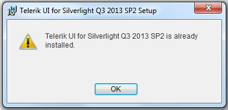

# Upgrading from Trial to Developer License or to a Newer Version

The purpose of this topic is to explain you how to upgrade Telerik UI Trial to Telerik UI Developer License or a newer version.

## Automatic Upgrade to newer version of UI for Silverlight

Utilize the VS Extensions wizards for this purpose:

* [Latest Version Acquirer Tool]()

* [Upgrading to a new UI for Silverlight distribution]()

## Upgrade to Newer Version or Other License of UI for Silverlight

In order to upgrade your controls to a newer version of the suite, you need to perform the following instructions:

* Download the installation method you prefer:
						
	* [MSI file for automatic installation.]()

	* [ZIP file for manual (advanced) installation.]()

	* [Latest Internal Build]()

>If you have installed the trial version of UI for Silverlight and try to install the developer version of the same release, you will receive the following message:
>
>So, you should remove the trial version first.

* If the upgrade is major (i.e. from Q2 2011 to Q3 2011), check the [Release History](http://www.telerik.com/products/silverlight/whats-new.aspx).
					
* Back up your application.

* Update all the Telerik references in your project in Visual Studio to point to the new DLLs.

* Clean the solution.

* Recompile your project.

* Run the project.

>In case the project does not build:          
>* Please make sure that all the assemblies you have referenced are with the same version.
>* If this does not help, delete the bin and obj folders of the project manually and Rebuild.
            
## See Also

 * [Controls Dependencies]()
